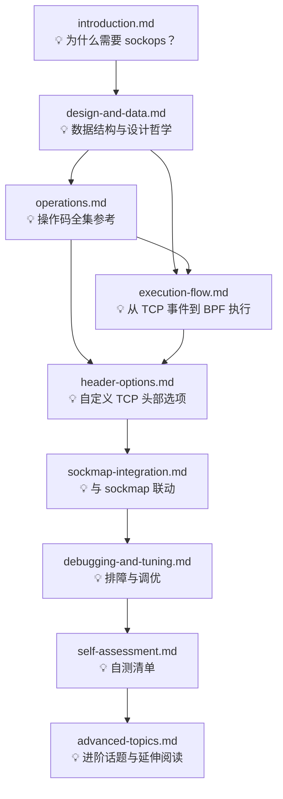

# BPF_PROG_TYPE_SOCK_OPS

> **速览：** sockops 是 Linux 内核中嵌入 TCP 协议栈深处的 BPF 钩子。它不逐包拦截网络流量，而是在 TCP 连接生命周期的关键决策点（建连、RTO 超时、状态迁移、自定义头部选项读写等）让 BPF 程序介入——就像在 TCP 状态机上装了可编程的"传感器"和"操纵杆"。

---

## 目录索引

| 分册文件 | 内容简介 | 阅读耗时（估） |
|---|---|---|
| [introduction.md](./introduction.md) | 历史背景与痛点分析、前置知识指引 | 10 min |
| [design-and-data.md](./design-and-data.md) | 核心数据结构（`bpf_sock_ops`、`bpf_sock_ops_kern`）、设计决策树 | 20 min |
| [operations.md](./operations.md) | BPF_SOCK_OPS_* 操作码全集参考手册（同步操作、通知回调、时间戳回调） | 25 min |
| [execution-flow.md](./execution-flow.md) | 从 TCP 事件到 BPF 程序执行的完整树形调用链、TCP 状态机回调映射 | 30 min |
| [header-options.md](./header-options.md) | TCP 自定义头部选项的读写机制（`bpf_store_hdr_opt` / `bpf_load_hdr_opt`）深度解剖 | 25 min |
| [sockmap-integration.md](./sockmap-integration.md) | sockops 与 sockmap/sockhash 联动机制、四层负载均衡实战 | 20 min |
| [debugging-and-tuning.md](./debugging-and-tuning.md) | 生产环境排障决策树、ftrace/bpftrace 诊断命令、常见配置错误 | 15 min |
| [self-assessment.md](./self-assessment.md) | 20 道自测题，检验是否真正精通 sockops | 20 min |
| [advanced-topics.md](./advanced-topics.md) | 遗漏点补充、相邻 BPF 类型协作、CO-RE 可移植性、安全模型、性能量化、历史 Bug、内核版本演进、延伸阅读索引 | 20 min |

---

## 术语速查表

本表收录全分册中首次出现的核心术语。阅读任意章节时若遇生词，可返回此处速查。

| 术语 | 定义 | 详见章节 |
|---|---|---|
| **sockops** | `BPF_PROG_TYPE_SOCK_OPS` 程序类型的简称，工作在 cgroup 层级，在 TCP 连接生命周期关键点被触发执行 | introduction |
| **BPF 程序类型（prog type）** | 决定 BPF 程序可访问的上下文结构体、可调用的辅助函数集合、以及挂载方式的内核分类体系 | design-and-data |
| **cgroup attach** | sockops 程序的挂载方式：绑定到一个 cgroup 目录，该 cgroup 内所有进程创建的 TCP socket 均受其管辖 | execution-flow |
| **`struct bpf_sock_ops`** | 传递给 sockops 程序的 UAPI 上下文结构体，包含当前操作码、IP/端口、TCP 运行参数、skb 数据指针等 | design-and-data |
| **`struct bpf_sock_ops_kern`** | 内核在调用 BPF 程序前从 `tcp_sock` 填充的内部上下文结构体，是 `bpf_sock_ops` 的数据源 | design-and-data |
| **操作码（opcode）** | `BPF_SOCK_OPS_*` 枚举值，指示当前回调的触发原因（建连、RTO、状态迁移等），BPF 程序通过 `op` 字段识别 | operations |
| **同步操作（synchronous op）** | 内核期望 BPF 程序返回一个具体值的操作码（如 `TIMEOUT_INIT` 返回 RTO 值），内核直接消费该返回值 | operations |
| **通知回调（notification callback）** | 内核异步触发、不期望返回值的操作码（如 `STATE_CB`、`RTO_CB`），需通过回调标志位显式启用 | operations |
| **回调标志位（cb_flags）** | 存储在 `tcp_sock->bpf_sock_ops_cb_flags` 中的位掩码，控制通知回调是否被触发，由 `bpf_sock_ops_cb_flags_set()` 设置 | operations |
| **`tcp_call_bpf()`** | 位于 `include/net/tcp.h` 的内联函数，封装了 sockops 调用的完整流程：构造 kern 上下文 → 调用 cgroup 程序 → 返回 reply | execution-flow |
| **TCP 头部选项（TCP header option）** | TCP 协议头中的可变长度字段（Kind-Length-Value），sockops 可在 SYN/数据包中写入或解析自定义选项 | header-options |
| **HDR_OPT_LEN_CB / WRITE_HDR_OPT_CB / PARSE_HDR_OPT_CB** | 头部选项专用的三个操作码：预留空间 → 写入选项 → 解析接收选项，需 `WRITE_HDR_OPT_CB_FLAG` 和解析标志位启用 | header-options |
| **sockmap / sockhash** | 存储 socket 引用的 BPF map 类型，sockops 可在建连时将 socket 插入 map，供 sk_skb 程序做流量重定向 | sockmap-integration |
| **TX 时间戳回调** | 一组精细的时间戳操作码（`TSTAMP_SCHED_CB`、`TSTAMP_SND_SW_CB` 等），记录 skb 在发送路径各阶段的时间点 | operations |
| **JIT 上下文重写** | BPF 验证器在加载时将 `bpf_sock_ops` 字段访问重写为对 `struct sock` / `struct tcp_sock` 的实际偏移访问，确保零开销 | execution-flow |

---

## 阅读依赖引导

下图给出了各分册之间的前置依赖关系。建议按箭头方向依次阅读，但各章也设计了「自包含」的开头和结尾，方便碎片化跳读。



### 推荐阅读路径

1. **快速入门路径**（约 30 分钟）：`introduction` → `operations`（仅阅读同步操作和活跃建连回调部分） → `debugging`
2. **标准学习路径**（约 3 小时）：按上图中 `introduction` → `design-and-data` → `operations` → `execution-flow` → `header-options` → `sockmap-integration` → `debugging` → `self-assessment` → `advanced-topics` 顺序完整阅读
3. **深度研究路径**：在标准路径基础上，每章末尾的「📝 一句话回顾」会给出进一步阅读的内核源码文件索引

### 前置知识要求

阅读本书前，你应当掌握以下内核基础知识：

- **BPF 基础**：理解 BPF 程序的基本概念（程序类型、map、辅助函数、验证器），了解 `libbpf` 加载模型
- **TCP 协议基础**：三次握手、状态机（CLOSED → SYN_SENT → ESTABLISHED → FIN_WAIT → CLOSED）、RTO 超时重传机制、拥塞控制窗口
- **cgroup 基础**：理解 cgroup v2 目录结构和层级继承关系

若你尚未掌握以上知识点，建议先分别阅读内核文档 `Documentation/bpf/` 和 `Documentation/networking/` 中的对应章节。

---

## 快速接入示例

以下是一个最小化 sockops 程序，展示核心范式——在 TCP 建连时设置自定义 RTO 最小值：

```c
// 文件: minimal_sockops.bpf.c
// 意图: 为同机房连接设置 20ms 的最小 RTO

#include <linux/bpf.h>
#include <bpf/bpf_helpers.h>

SEC("sockops")
int handle_sockops(struct bpf_sock_ops *ctx)
{
    /* 仅处理 TIMEOUT_INIT 操作 */
    if (ctx->op != BPF_SOCK_OPS_TIMEOUT_INIT)
        return 0;

    /* 仅影响本地连接（同一子网） */
    if ((ctx->local_ip4 ^ ctx->remote_ip4) & 0xff000000)
        return 0;

    /* 返回 20 jiffies 作为 SYN RTO */
    ctx->reply = 20;
    return 1;
}

char LICENSE[] SEC("license") = "GPL";
```

```bash
# 编译与加载
$ clang -O2 -target bpf -c minimal_sockops.bpf.c -o minimal_sockops.bpf.o
$ bpftool prog load minimal_sockops.bpf.o /sys/fs/bpf/sockops_prog \
         type sockops
$ bpftool cgroup attach /sys/fs/cgroup/unified/ sock_ops \
         pinned /sys/fs/bpf/sockops_prog
$ bpftool prog show pinned /sys/fs/bpf/sockops_prog
```

---

*本分册由 AI 辅助编写，遵循 Linux 内核源码 `/code/linux` 的实际实现。所有内核函数标注格式为 `函数名 @ 文件路径:行号`。*
