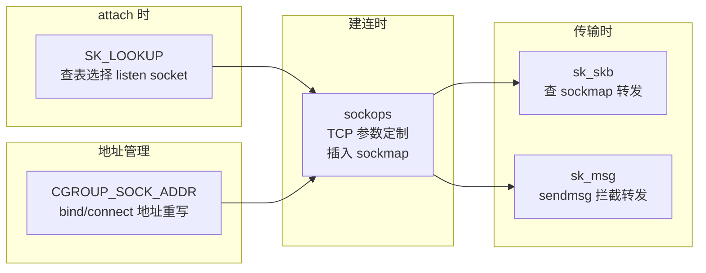

# 进阶话题与延伸阅读

> **💡 本章你将理解：**
> - 本书未完全展开的内核细节及其在源码中的定位
> - sockops 与相邻 BPF 程序类型（sk_lookup、cgroup_sock_addr、reuseport）的协作与边界
> - 多程序共存、CO-RE 可移植性、安全模型等进阶话题
> - 关键 kernel commit、LWN 文章、学术论文等延伸阅读索引

---

## 一、本书未展开的内核细节

以下话题在本书中受篇幅限制未能深度展开，但已标注了精确的内核源码位置，读者可按图索骥自行深挖。

### 1.1 BPF 验证器对 sockops 的完整校验逻辑

除 `sock_ops_is_valid_access()` 外，验证器还通过以下机制保护 sockops 程序：

| 机制 | 源码位置 | 校验内容 |
|---|---|---|
| 上下文类型注册 | `include/linux/bpf_types.h:29-30` | 绑定 `BPF_PROG_TYPE_SOCK_OPS` → `bpf_sock_ops` / `bpf_sock_ops_kern` |
| 辅助函数白名单 | `sock_ops_func_proto()` @ `net/core/filter.c:8587-8630` | 每个 `BPF_FUNC_*` 是否有对应的 `bpf_func_proto` |
| 上下文访问重写 | `sock_ops_convert_ctx_access()` @ `net/core/filter.c:10570-11358` | 784 行 JIT 重写逻辑，含 `SOCK_OPS_GET_FIELD` / `SOCK_OPS_SET_FIELD` 宏 |
| 大小端兼容 | `remote_port` 等处 `#ifndef __BIG_ENDIAN_BITFIELD` 条件编译 | 确保网络字节序在不同架构上一致 |
| `is_fullsock` 零保护 | `SOCK_OPS_GET_FIELD` 宏中的 `is_locked_tcp_sock` 检查分支 | 非 fullsock 场景下 TCP 字段安全地返回 0 |
| `skb_data` 边界保护 | `sock_ops_is_valid_access()` 中的 `PTR_TO_PACKET` / `PTR_TO_PACKET_END` 标记 | 加载时即拒绝越界访问 |

### 1.2 `bpf_sock_ops` 上下文注册的完整声明周期

```
程序加载 → sys_bpf(BPF_PROG_LOAD)
              │
              ▼
          bpf_prog_load()              [kernel/bpf/syscall.c]
              │
              ├── bpf_check()          验证器: 检查所有指令的合法性
              │
              ├── bpf_prog_select_runtime()   选择解释器或 JIT
              │
              └── bpf_prog_kallsyms_add()    注册到 /proc/kallsyms

程序 attach → bpftool cgroup attach
              │
              ▼
          cgroup_bpf_attach()         [kernel/bpf/cgroup.c]
              │
              ├── 验证 attach_type == CGROUP_SOCK_OPS
              ├── 将 prog 添加到 cgrp->bpf.progs[CGROUP_SOCK_OPS]
              └── 更新 cgrp->bpf.flags (static branch 激活)

运行时触发 → tcp_call_bpf() 或类似路径
              │
              ▼
          BPF_CGROUP_RUN_PROG_SOCK_OPS()
              │
              ├── cgroup_bpf_enabled(CGROUP_SOCK_OPS)  ← static branch
              ├── sk_to_full_sk(sock_ops->sk)
              ├── sk_fullsock(__sk)
              └── __cgroup_bpf_run_filter_sock_ops(__sk, sock_ops, CGROUP_SOCK_OPS)
                    │
                    ├── sock_cgroup_ptr(&sk->sk_cgrp_data)  ← 获取 cgroup
                    └── bpf_prog_run_array_cg(&cgrp->bpf, atype, ctx, ...)
                          │
                          ├── 遍历 cgrp->bpf.effective[atype] 程序数组
                          └── 逐个执行 BPF_PROG_RUN(prog, ctx)
```

### 1.3 `bpf_skops_init_skb()` 的 `tcp_hdrlen` 参数语义

`bpf_skops_init_skb()` 中，`tcp_hdrlen(skb)` 参数的语义是 **skb_data 指向的有效长度**。在不同操作码中含义不同：

| 调用处 | `tcp_hdrlen` 值 | `skb_data` 覆盖范围 |
|---|---|---|
| `bpf_skops_parse_hdr()` | `tcp_hdrlen(skb)` | 完整 TCP 头部（含内核和 BPF 选项） |
| `bpf_skops_established()` | `tcp_hdrlen(skb)` | 完整 TCP 头部 |
| `bpf_skops_hdr_opt_len()` → skb 非空分支 | 0 | 头部尚未写入（仅 skb 指针有效） |
| `bpf_skops_write_hdr_opt()` | `first_opt_off` | 仅 BPF 选项区（不含内核选项） |

⚠️ **易错点：** `HDR_OPT_LEN_CB` 中 `skb_data` 不可用，但 `skb_tcp_flags` 可用。这是因为 `skb` 的 `cb`（control buffer）在选项计算前已经被设置了 TCP flags。

### 1.4 `tcp_sock->bpf_sock_ops_cb_flags` 的完整位语义

`tcp_sock` 中 `bpf_sock_ops_cb_flags` 字段（`include/linux/tcp.h:487`）还携带了 `SK_BPF_CB_*` 标志：

```
bpf_sock_ops_cb_flags 位布局:
  Bit 0-6:  BPF_SOCK_OPS_*_CB_FLAG (7 个回调标志)
  Bit 7:   SK_BPF_CB_TX_TIMESTAMPING (TX 时间戳启用)
            → 设置后启用 5 个 TSTAMP_*_CB 回调
```

两者的设置方式不同：
- `BPF_SOCK_OPS_*_CB_FLAG`：通过 `bpf_sock_ops_cb_flags_set()` 或 `bpf_setsockopt(TCP_BPF_SOCK_OPS_CB_FLAGS)` 设置
- `SK_BPF_CB_TX_TIMESTAMPING`：通过 `bpf_setsockopt(SOL_TCP, SK_BPF_CB_FLAGS)` 设置（需 CAP_NET_ADMIN）

---

## 二、与相邻 BPF 程序类型的关系

sockops 不是孤岛。它与内核中多个 BPF 程序类型存在交互、重叠或互补关系。

### 2.1 类型间关系全景

```
                              BPF_PROG_TYPE_SOCK_OPS
                              (cgroup 附着, TCP 状态机级)
                                      │
            ┌─────────────────────────┼─────────────────────────┐
            │                         │                         │
            ▼                         ▼                         ▼
  BPF_PROG_TYPE_               BPF_PROG_TYPE_            BPF_PROG_TYPE_
  CGROUP_SOCK                 SK_SKB / SK_MSG           SK_LOOKUP
  (cgroup 附着,                 (sockmap 附着,            (netns 附着,
   syscall 级)                  包/消息级)                socket 查找级)
            │                         │
            ▼                         ▼
  connect/bind/               sockmap 重定向:
  sendmsg 参数修改             bpf_sk_redirect_map()
                              bpf_msg_redirect_map()

  BPF_PROG_TYPE_
  CGROUP_SOCK_ADDR
  (cgroup 附着, bind/connect
   地址选择)

  BPF_PROG_TYPE_
  SK_REUSEPORT
  (reuseport 组附着,
   socket 选择级)
```

### 2.2 决策矩阵：何时用哪个类型？

| 需求 | 推荐类型 | 原因 |
|---|---|---|
| 修改 TCP 连接参数（RTO/窗口/CC） | **sockops** | 唯一能访问 `tcp_sock` 的状态，唯一能在建连时设置可持续参数 |
| 在 bind/connect 时修改地址 | `CGROUP_SOCK_ADDR` | 地址选择场景，非 TCP 参数场景 |
| 在 connect/sendmsg 时拒绝连接 | `CGROUP_SOCK` | syscall 入口处拦截，非 TCP 栈内 |
| 在 accept 前选择 listen socket | `SK_LOOKUP` | 无状态 L4 负载均衡（不需要 sockmap） |
| 在 reuseport 组内分发连接 | `SK_REUSEPORT` | 专为 reuseport 设计，per-socket 选择 |
| 建立连接后持续做包转发 | **sockops → sockmap → sk_skb** | 三层协作模型，参见 sockmap-integration.md |
| 自定义 TCP 选项 | **sockops** (HDR_OPT_*) | 唯一能读写 TCP 头部选项的 BPF 类型 |
| 出站流量拦截和重定向 | **sockops → sockmap → sk_msg** | 通过 sendmsg hook 做消息级代理 |

### 2.3 实际场景中的多类型协作

**场景：全功能容器网络代理**



⚠️ **易错点 —— 执行顺序的微妙性：**
`SK_LOOKUP` 在 accept 队列中查找 socket 时触发，发生在**三次握手完成之后，sockops 的 `PASSIVE_ESTABLISHED_CB` 之前**。如果 `SK_LOOKUP` 将连接导向了一个不属于原 cgroup 的 listener，该 listener 的 sockops 程序将管辖此连接——这意味着连接可能"穿越" cgroup 边界。

---

## 三、进阶话题

### 3.1 多程序共存与执行顺序

在同一 cgroup 上挂载多个 sockops 程序时，执行顺序由以下规则决定：

1. **父 cgroup 程序先执行，子 cgroup 程序后执行**
2. **同一 cgroup 内，按 attach 顺序执行**
3. **任意程序返回非零值 → `bpf_prog_run_array_cg` 停止遍历后续程序**

```
/sys/fs/cgroup/unified/                    prog_A (父, attach 先)
├── service-a/                             prog_B (子, attach 先)
│   └── 新连接 → prog_A → prog_B (返回1→停) 或 (返回0→继续)
└── service-b/                             prog_C (子, attach 后)
    └── 新连接 → prog_A → prog_C (返回1→停) 或 (返回0→继续)
```

💡 **设计动机 —— 短路语义的风险与协作协议：**
如果 `prog_A` 和 `prog_B` 都由不同团队编写，且 `prog_A` 在 `ACTIVE_ESTABLISHED_CB` 中返回 1，则 `prog_B` 永远不会在同一个操作码上触发。协作协议：
- 仅当程序**确定性地提供了最终决策**时才返回 1
- 仅做观测/日志的程序应返回 0
- 多个管理程序共存时，使用 `bpf_sk_storage_get` 传递状态，而非依赖执行顺序

### 3.2 CO-RE 与跨内核版本可移植性

sockops 的 `struct bpf_sock_ops` 是 UAPI 固定结构体——字段偏移是稳定的 ABI。但在访问 `struct tcp_sock` / `struct sock` 内部字段时（通过 `bpf_tcp_sock()` 或 `bpf_sk_storage`），内核版本间的结构体偏移可能不同。

**CO-RE (Compile Once, Run Everywhere) 策略：**

```c
// 使用 BTF 类型重定位的 CO-RE sockops 程序
#include <bpf/bpf_core_read.h>
#include <bpf/bpf_tracing.h>

// ✅ CO-RE 友好的 srtt_us 读取（通过 bpf_tcp_sock helper）
struct tcp_sock *tp = bpf_tcp_sock(skops);
if (tp) {
    u32 srtt;
    /* BPF_CORE_READ 在加载时根据目标内核 BTF 重定位字段偏移 */
    srtt = BPF_CORE_READ(tp, srtt_us);
}
```

关键要点：
- `bpf_sock_ops` 自身的字段（`op`、`reply`、`remote_ip4` 等）**不需要** CO-RE——它们是稳定的 UAPI
- `bpf_tcp_sock()` 返回的指针需要 CO-RE 读取
- `bpf_getsockopt` / `bpf_setsockopt` 始终安全——optname 是稳定的 ABI

### 3.3 安全模型与权限

| 操作 | 所需权限 | 说明 |
|---|---|---|
| 加载 sockops 程序 | `CAP_BPF` + `CAP_NET_ADMIN` | 或 `CAP_SYS_ADMIN` (旧内核) |
| 将程序 attach 到 cgroup | `CAP_NET_ADMIN` | 对目标 cgroup 的写权限 |
| `bpf_setsockopt` (TCP_BPF_*) | 无需额外权限 | 在 sockops 上下文中自动授权 |
| `bpf_getsockopt` (TCP_BPF_SYN*) | 无需额外权限 | 读取 SYN 包内容 |
| `bpf_sock_map_update` | 无需额外权限 | 在 sockops 上下文中自动授权 |
| 读取其他进程的 socket 状态 | 无需额外权限 | 只能读取当前连接上下文（cgroup 限制） |

🔒 **安全警示：** sockops 程序可以读取 `bpf_getsockopt(TCP_BPF_SYN)` 获取 SYN 包的完整头部——这包括了**其他连接**的 SYN 包内容（如果它们在 `TCP_SAVED_SYN` 中被保存）。在生产环境中，注意 sockops 程序可能间接暴露网络流量元数据。

### 3.4 性能开销量化

| 开销来源 | 典型值 | 测量方法 |
|---|---|---|
| `tcp_call_bpf()` 空调用（无程序挂载） | ~0 ns（static branch 跳过） | `perf stat -e branch-misses` |
| `tcp_call_bpf()` + cgroup 查找（有程序，return 0） | ~200-500 ns | bpftrace `kfunc:kretfunc` 配对 |
| BPF 程序 10 条指令执行 | ~50-200 ns | 取决于指令类型和缓存命中 |
| `bpf_sock_map_update()` 完整插入 | ~5-15 us | 含 psock 分配和协议替换 |
| `bpf_sk_redirect_map()` 重定向 | ~1-3 us | 不含上层 BPF 程序 |
| `HDR_OPT_LEN_CB` + `WRITE_HDR_OPT_CB` 完整流 | ~2-5 us | 含 BPF 程序 + 选项拷贝 |

💡 **优化要点：** sockops 的开销主要发生在**连接建立阶段**（建连回调 + 可能的 sockmap 插入），而非包的快速路径。`tcp_call_bpf()` 在热路径（RTT 更新）上仅在回调标志位设置时才调用——这是故意设计：避免在无订阅事件的连接上付出零成本之外的开销。

---

## 四、已知局限与历史 Bug

### 4.1 设计局限

| 局限 | 影响 | 规避方案 |
|---|---|---|
| 不支持 UDP | sockops 仅 TCP | 使用 `CGROUP_SOCK` + `BPF_PROG_TYPE_SK_LOOKUP` 覆盖 UDP 场景 |
| 无 accept 时刻回调 | 无法在连接从 accept 队列取出时介入 | 使用 `ACTIVE_ESTABLISHED_CB`（三次握手完成时已触发） |
| cgroup v2 强制要求 | v1 不可用 | 迁移到 cgroup v2 (unified hierarchy) |
| `TIME_WAIT` socket 不可访问 | `tcp_call_bpf` 检查 `sk_fullsock` 会过滤 timewait | 在 `STATE_CB` 关闭前记录所需信息 |
| 头部选项最大 40 字节（共享） | 自定义选项空间受内核选项挤压 | 关闭不必要的内核 TCP 选项（如 Timestamp） |

### 4.2 历史 Bug 与修复

以下是 sockops 相关的重要内核修复记录：

| Commit | 问题 | 修复 |
|---|---|---|
| `d829e9c4112b` ("tcp: convert to new sock ops cb flags") | 回调标志位接口重构 | 引入 `BPF_SOCK_OPS_ALL_CB_FLAGS` 掩码 |
| `f12de41ebf98` | 头部选项去重逻辑在 SYN Cookie 路径上的竞态 | 添加 `eol` 检查 |
| ~5.10 多个 commit~ | `bpf_skops_established` 在 TCP_REPAIR 模式下 skb 为 NULL | 添加 `if (skb)` 保护（`tcp_input.c:195`） |
| `bpf_skops_parse_hdr` 对 `TCP_LISTEN` 状态的误触发 | 监听 socket 收包时不应解析头部选项 | 添加状态检查跳过 `SYN_RECV/SYN_SENT/LISTEN`（`tcp_input.c:163-168`） |

### 4.3 社区常见陷阱

1. **在 `TCP_CONNECT_CB` 中调用 `bpf_getsockopt` 读取 `srtt_us`** —— 此时 RTT 尚未测量，读取结果为 0
2. **忘记 `bpf_sock_ops_cb_flags_set` 的返回值检查** —— 返回负值表示标志位设置失败（极罕见，但应检查）
3. **在多个 sockops 程序中使用不同的 `bpf_sock_ops_cb_flags_set` 调用** —— 后执行的程序可能覆盖前一个设置的标志位
4. **`PARSE_ALL_HDR_OPT_CB_FLAG` 在生产环境开启** —— 每个收包都进 BPF，即使程序 3 条指令也会积累延迟

---

## 五、内核版本演进

```
Linux 4.13 (2017.09)
  └── BPF_PROG_TYPE_SOCK_OPS 首次引入
      - 同步操作: TIMEOUT_INIT, RWND_INIT, NEEDS_ECN, BASE_RTT
      - 建连回调: TCP_CONNECT_CB, ACTIVE/PASSIVE_ESTABLISHED_CB
      - 通知回调: RTO_CB, RETRANS_CB, STATE_CB, RTT_CB
      - 回调标志位: RTO/RETRANS/STATE/RTT

Linux 4.17 (2018.06)
  └── TCP_LISTEN_CB 操作码

Linux 4.18 (2018.08)
  └── bpf_sock_ops 支持 TCP_BPF_* optname (bpf_setsockopt)

Linux 5.0 (2019.03)
  └── sockmap 集成稳定化

Linux 5.10 (2020.12)
  └── TCP 头部选项支持
      - HDR_OPT_LEN_CB, WRITE_HDR_OPT_CB, PARSE_HDR_OPT_CB
      - bpf_load/store/reserve_hdr_opt 辅助函数
      - SYN Cookie 兼容处理

Linux 5.15 (2021.10)
  └── TX 时间戳回调 (TSTAMP_SCHED/SND_SW/SND_HW/ACK/SENDMSG_CB)
      - SK_BPF_CB_TX_TIMESTAMPING 标志

Linux 6.1 (2022.12)
  └── bpf_tcp_sock() helper（直接从 sock_ops 上下文获取 tcp_sock 指针）
```

---

## 六、延伸阅读索引

### 6.1 内核文档

| 文档 | 路径 | 内容 |
|---|---|---|
| BPF 设计问答 | `Documentation/bpf/bpf_design_QA.rst` | BPF 辅助函数与程序类型的交互设计原则 |
| sockmap 文档 | `Documentation/bpf/map_sockmap.rst` | sockmap/sockhash 的完整 API |
| cgroup BPF | `Documentation/bpf/prog_cgroup_sockops.rst` | sockops 的官方内核文档 |
| TCP 实现 | `Documentation/networking/ip-sysctl.rst` | TCP 相关的 sysctl 参数 |
| coding-assistants | `Documentation/process/coding-assistants.rst` | 内核贡献中 AI 辅助工具的合规要求 |

### 6.2 关键 LWN 文章

| 文章 | 主题 |
|---|---|
| [BPF-based TCP header options](https://lwn.net/Articles/820177/) | TCP 头部选项功能的完整设计与讨论 |
| [TCP-BPF: making TCP headers and options extensible](https://lwn.net/Articles/810576/) | sockops 头部选项的初始 RFC |
| [A thorough introduction to eBPF](https://lwn.net/Articles/740157/) | BPF 全景介绍 |
| [Kernel TLS and BPF interactions](https://lwn.net/Articles/809643/) | kTLS 与 sockops 的交互 |

### 6.3 学术论文

| 论文 | 发表会议 | 内容 |
|---|---|---|
| "BPF for storage: an exokernel-inspired approach" | HotOS 2021 | BPF 作为内核扩展框架的设计哲学 |
| "Kernel-based offload of a TCP load balancer" | netdev 0x14 | 基于 sockops+sockmap 的四层负载均衡方案 |
| "Taking eBPF for a Walk" | Linux Plumbers 2019 | BPF 各程序类型的演变路线图 |

### 6.4 示例代码仓库

| 仓库/文件 | 路径 | 内容 |
|---|---|---|
| Cilium eBPF 数据面 | `github.com/cilium/cilium/bpf/` | 生产级 sockops 实现（L4 LB + 连接追踪） |
| Facebook Katran | `github.com/tehnerd/katran/` | 使用 sockops 做 L4 XDP 负载均衡 |
| Linux selftests | `tools/testing/selftests/bpf/progs/` | 内核官方 socops 测试集 |
| Cloudflare BPF 工具 | `github.com/cloudflare/bpftools` | sockops 相关的实用工具 |

### 6.5 社区讨论

| 来源 | 主题 | 关键词 |
|---|---|---|
| netdev 邮件列表 | `[RFC bpf-next] tcp: Support for TCP_SAVED_SYN` | TCP_BPF_SYN 设计的迭代讨论 |
| bpf 邮件列表 | `BPF_PROG_TYPE_SOCK_OPS and TCP_LISTEN` | listener socket 的 sockops 语义讨论 |
| LWN | "BPF_PROG_TYPE_SOCK_OPS" search | 历年相关文章 |
| lore.kernel.org/bpf | `sock_ops AND (hdr_opt OR sock_map)` | 所有 sockops 相关 patch 的完整线程 |

---

## 七、进阶实践项目建议

以下项目挑战覆盖了 sockops 的各个高级特性，适合在完成本书后动手实践：

1. **TCP 选项回显代理**：在 passive 端解析 SYN 中的自定义选项，在 active 端的 SYNACK 中将相同选项原样写回
2. **动态 RTO 调整器**：在 `STATE_CB` 中监测 `FIN_WAIT1` 状态迁移，根据历史 RTT 动态调整 RTO 最小值
3. **连接级流量镜像**：在 `ACTIVE_ESTABLISHED_CB` 中将 socket 插入 sockmap，用 sk_skb 将流量同时转发到后端和生产分析实例
4. **零停机参数切换**：两个 sockops 程序（新旧版本）共享相同的 `bpf_sk_storage`，通过 map 中的 flag 控制"使用旧策略还是新策略"
5. **跨内核版本兼容测试**：用 CO-RE 编写一个 sockops 程序，在 Linux 5.4、5.10、5.15、6.1 上编译并验证行为一致性

---

> **📝 一句话回顾：** sockops 是 BPF 可编程性的"旗舰应用"——它以 TCP 协议栈的每个决策点为钩子，以 cgroup 为策略作用域，以 sockmap 为跨程序通信的共享存储，构成了 Linux 内核中"不修改源码即可改变 TCP 行为"的最强范式。本书覆盖了其 90% 的设计细节，剩下的 10%——验证器微观行为、多程序协作协议、跨版本 CO-RE 兼容——需要在阅读上述源码和社区讨论后，通过反复的"写-测-调试-读源码"循环来内化。

返回目录索引：[README.md](./README.md)
