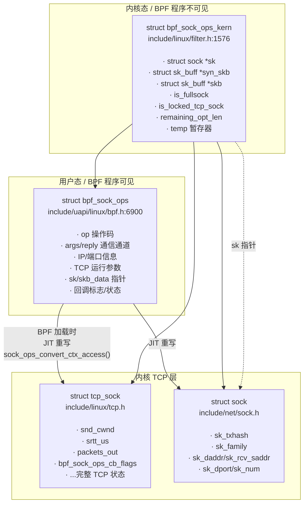
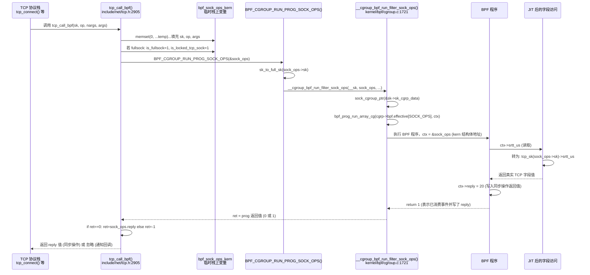

# 数据结构与设计哲学

> **💡 本章你将理解：**
> - `struct bpf_sock_ops` 与 `struct bpf_sock_ops_kern` 的完整骨架，以及它们之间的映射机制
> - 内核为什么设计了"UAPI 上下文 + JIT 重写"双层结构而非直接暴露内核结构体
> - sockops 五项重大设计决策背后的选项树分析

---

## 一、核心数据结构全景

sockops 围绕两个表面相似、职责截然不同的结构体展开：



> **直觉描述：** `bpf_sock_ops` 是你写在 BPF 程序中看到的"假结构体"——它像一个精心设计的窗口，让你用统一字段名读写分散在 `struct sock`、`struct tcp_sock`、`struct sk_buff` 中的信息。`bpf_sock_ops_kern` 是内核真正构造的临时对象，`tcp_call_bpf()` 填充它之后，BPF 验证器再将其字段按规则"翻译"成对真实内核结构体的访问。

---

## 二、`struct bpf_sock_ops` —— UAPI 上下文完整解剖

**源码位置：** `include/uapi/linux/bpf.h:6900-6975`

```c
struct bpf_sock_ops {
    /* ──── 操作码与通信通道 ──── */
    __u32 op;                        // +0:  当前操作码 (BPF_SOCK_OPS_*)
    union {
        __u32 args[4];               // +4:  内核传入参数 (由操作码决定含义)
        __u32 reply;                 // +4:  同步操作的返回值 (BPF 程序写入)
        __u32 replylong[4];          // +4:  扩展返回值 (头部选项操作用)
    };

    /* ──── 连接标识 ──── */
    __u32 family;                    // +20: AF_INET 或 AF_INET6
    __u32 remote_ip4;                // +24: 远端 IPv4 (网络字节序)
    __u32 local_ip4;                 // +28: 本地 IPv4 (网络字节序)
    __u32 remote_ip6[4];             // +32: 远端 IPv6 (网络字节序)
    __u32 local_ip6[4];              // +48: 本地 IPv6 (网络字节序)
    __u32 remote_port;               // +64: 远端端口 (网络字节序)
    __u32 local_port;                // +68: 本地端口 (主机字节序)

    /* ──── socket 完整性标志 ──── */
    __u32 is_fullsock;               // +72: 是否完整 socket (非 request_sock)

    /* ──── TCP 拥塞与传输参数 (只读) ──── */
    __u32 snd_cwnd;                  // +76: 拥塞窗口 (报文数)
    __u32 srtt_us;                   // +80: 平滑 RTT (usec << 3)
    __u32 bpf_sock_ops_cb_flags;     // +84: 当前回调标志位
    __u32 state;                     // +88: TCP 状态 (BPF_TCP_*)
    __u32 rtt_min;                   // +92: 最小 RTT (usec)
    __u32 snd_ssthresh;              // +96: 慢启动阈值
    __u32 rcv_nxt;                   // +100: 期望接收的下一个序列号
    __u32 snd_nxt;                   // +104: 下一个发送序列号
    __u32 snd_una;                   // +108: 第一个未确认序列号
    __u32 mss_cache;                 // +112: 当前 MSS 缓存
    __u32 ecn_flags;                 // +116: ECN 标志

    /* ──── 传输统计 (只读) ──── */
    __u32 rate_delivered;            // +120: 速率估算——已交付报文数
    __u32 rate_interval_us;          // +124: 速率估算——采样间隔 (usec)
    __u32 packets_out;               // +128: 在途报文数
    __u32 retrans_out;               // +132: 在途重传报文数
    __u32 total_retrans;             // +136: 历史重传总数
    __u32 segs_in;                   // +140: 收到的总报文段数
    __u32 data_segs_in;              // +144: 收到的有数据报文段数
    __u32 segs_out;                  // +148: 发出的总报文段数
    __u32 data_segs_out;             // +152: 发出的有数据报文段数
    __u32 lost_out;                  // +156: 认定为丢失的报文数
    __u32 sacked_out;                // +160: SACK 确认的报文数
    __u32 sk_txhash;                 // +164: socket 发送哈希 ⚠️ 可写

    /* ──── 累计统计 (只读) ──── */
    __u64 bytes_received;            // +168: 累计接收字节
    __u64 bytes_acked;               // +176: 累计确认字节

    /* ──── 指针域 ──── */
    __bpf_md_ptr(struct bpf_sock *, sk);          // +184: socket 指针
    __bpf_md_ptr(void *, skb_data);               // +192: TCP 头部起始
    __bpf_md_ptr(void *, skb_data_end);           // +200: TCP 头部末尾+1

    /* ──── skb 元数据 ──── */
    __u32 skb_len;                   // +208: 报文总长度
    __u32 skb_tcp_flags;             // +212: TCP flags (SYN/ACK/FIN etc.)
    __u64 skb_hwtstamp;              // +216: 硬件时间戳
};
```

### 2.1 逐字段物理含义解析

#### 操作码 `op` (+0)
BPF_SOCK_OPS_* 枚举值。BPF 程序启动后第一件事通常是 `switch (ctx->op)`，根据操作码进入不同的处理分支。

#### `args` / `reply` / `replylong` 共用体 (+4)
这三个字段占据同一块内存，通过共用体重叠：

| 操作类型 | 生效字段 | 方向 | 语义 |
|---|---|---|---|
| 同步操作 (TIMEOUT_INIT, RWND_INIT, NEEDS_ECN, BASE_RTT) | `reply` | BPF→内核 | BPF 程序写入返回值；内核消费后生效 |
| 通知回调 (RTO_CB, RETRANS_CB, STATE_CB, RTT_CB) | `args[]` | 内核→BPF | 内核将事件参数写入 args；BPF 读取 |
| 头部选项 (HDR_OPT_LEN_CB) | `reply` + `replylong[0]` | BPF→内核 | reply 为预留长度，replylong[0] 为临时数据 |
| 头部选项 (WRITE_HDR_OPT_CB) | `replylong[]` | 双向 | 传递偏移和长度信息 |
| VOID 操作 | 不使用 | — | 无参数，无返回值 |

⚠️ **易错点：** `reply` 和 `args[0]` 共享同一内存地址。同步操作中写入 `reply` 的操作本质上覆盖了 `args[0]`。注意在 `switch` 分支中不要同时访问两者。

#### 连接标识字段 (+20 至 +68)
| 字段 | 数据来源（JIT 后） | 字节序 | 注意 |
|---|---|---|---|
| `family` | `sk->sk_family` (2B, 零扩展至 4B) | 主机 | IPv4=2, IPv6=10 |
| `remote_ip4` | `sk->sk_daddr` | 网络 | 即 `inet_sk(sk)->inet_daddr` |
| `local_ip4` | `sk->sk_rcv_saddr` | 网络 | 即 `inet_sk(sk)->inet_rcv_saddr` |
| `remote_port` | `sk->sk_dport` | 网络 | 注意：`sk_dport` 存储为网络字节序，需左移 16 位 |
| `local_port` | `sk->sk_num` | 主机 | 即 `inet_sk(sk)->inet_num` |

💡 **设计动机 —— 端口字节序差异：** `remote_port` 和 `local_port` 使用不同的字节序并非 bug。`sk_dport` 在内核中始终以网络字节序存储（避免每次查路由表时反复转换）；而 `sk_num` 以主机字节序存储（方便快速比较和哈希）。BPF 上下文选择忠实暴露内核存储格式，而非统一转换——因为这能让零拷贝读取的实现最高效。

#### `is_fullsock` (+72)
- 1: 当前 `sk` 指向完整 `struct sock`，所有 TCP 字段（snd_cwnd 等）有效
- 0: 当前仅有一个 `struct request_sock`（如在 SYN Cookie 场景下），TCP 字段被内核填充为 0

🔒 **并发安全警示：** `is_fullsock` 的值在 `tcp_call_bpf()` 中通过 `sk_fullsock(sk)` 判定（`include/net/tcp.h:2911`），判定瞬间持有 socket 锁（`sock_owned_by_me(sk)`），确保了与 socket 状态迁移之间的线性一致性。

#### TCP 拥塞与传输参数 (+76 至 +116)
所有 TCP 层字段在 BPF 程序中看似是 `bpf_sock_ops` 的成员变量，实际通过 JIT 重写为对 `struct tcp_sock` 的同名字段访问。以 `srtt_us` 为例：

```
BPF 程序写入:  r1 = ctx->srtt_us  // offsetof(bpf_sock_ops, srtt_us)=80
                        │
     sock_ops_convert_ctx_access() @ net/core/filter.c:10888
                        │
                        ▼
JIT 后等价于:
    r9 = ctx->is_locked_tcp_sock          // +12 of bpf_sock_ops_kern
    if r9 == 0 goto zero_out
    r9 = ctx->sk                           // +0 of bpf_sock_ops_kern
    r1 = *(u32 *)(r9 + offsetof(tcp_sock, srtt_us))
    goto done
zero_out:
    r1 = 0
done:
```

💡 **设计动机：** 当 `is_locked_tcp_sock` 为 0（request_sock 场景）时，JIT 插入的分支会将 TCP 字段读出值设为 0。这条"零保护"确保了 BPF 程序不会意外读取 request_sock 后未初始化内存而触发验证器拒绝加载。

#### `sk_txhash` (+164) —— 唯二可写字段

**数据来源：** `struct sock->sk_txhash`（`include/net/sock.h`）。在 `sock_ops_is_valid_access()`（`net/core/filter.c:9471-9480`）中，只有 `reply` 和 `sk_txhash` 被允许写操作。写入 `sk_txhash` 可影响后续发送 packet 时的 flow label / 队列选择（用于 RPS/RFS）。

#### `skb_data` / `skb_data_end` (+192, +200) —— 包数据窗口

仅在特定操作码下有值：

| 操作码 | `skb_data` 指向 |
|---|---|
| `ACTIVE_ESTABLISHED_CB` | 完成三次握手的 SYNACK 包的 TCP 头部 |
| `PASSIVE_ESTABLISHED_CB` | 完成三次握手的 ACK 包的 TCP 头部 |
| `PARSE_HDR_OPT_CB` | 当前接收包的 TCP 头部 |
| `WRITE_HDR_OPT_CB` | 当前正在构造的发送包 TCP 头部（选项区） |
| `HDR_OPT_LEN_CB` | 无效（头部尚未写入），但 `skb_tcp_flags` 可用 |
| 其他操作码 | NULL |

🔒 **并发安全警示：** `skb_data` 和 `skb_data_end` 构成一个 BPF 程序内的数据窗口指针对。BPF 验证器会在 `sock_ops_is_valid_access()`（`filter.c:9493-9502`）中将这些指针标记为 `PTR_TO_PACKET` / `PTR_TO_PACKET_END`，从而启用边界检查保护——任何超出 `[skb_data, skb_data_end)` 的访问都会被验证器在加载时拒绝。

---

## 三、`struct bpf_sock_ops_kern` —— 内核内部桥梁

**源码位置：** `include/linux/filter.h:1576-1599`

```c
struct bpf_sock_ops_kern {
    struct sock    *sk;                 // 目标 socket 指针
    union {
        u32         args[4];           // 操作参数 / BPF 返回值的存储
        u32         reply;             // 与 bpf_sock_ops::reply 共享布局
        u32         replylong[4];
    };
    struct sk_buff *syn_skb;           // SYN/SYNACK 包 (头部选项解析用)
    struct sk_buff *skb;               // 当前数据包 (skb_data 的来源)
    void           *skb_data_end;      // 数据包末尾指针
    u8              op;                // 操作码 (u8 而非 u32)
    u8              is_fullsock;       // 是否完整 socket
    u8              is_locked_tcp_sock; // socket 是否由当前线程锁定
    u8              remaining_opt_len; // 头部选项剩余空间
    u64             temp;              // JIT 代码生成时的暂存寄存器
};
```

### 3.1 `is_locked_tcp_sock` —— 最强的并发安全守卫

```c
// tcp_call_bpf() @ include/net/tcp.h:2911-2914
if (sk_fullsock(sk)) {
    sock_ops.is_fullsock = 1;
    sock_ops.is_locked_tcp_sock = 1;
    sock_owned_by_me(sk);  // 断言：调用者持有 socket 锁
}
```

这三个连续设置的逻辑链：

1. `sk_fullsock(sk)` —— 确认 sk 不是 request_sock 或 timewait_sock
2. `is_locked_tcp_sock = 1` —— 标记"当前持有锁"
3. `sock_owned_by_me(sk)` —— **带 `LOCKDEP` 的锁持有断言**：如果当前线程未持有该 socket 的锁，此处触发 lockdep 警告

**这意味着什么？** 任何 sockops 回调触发时，当前线程**必然持有该 socket 的锁**。BPF 程序读取的所有 TCP 字段（snd_cwnd、srtt_us 等）都是线程安全的快照。这不是巧合——所有 TCP 调用点（`tcp_connect()`、`tcp_finish_connect()`、`tcp_set_state()`）的调用者本身就持有锁。

### 3.2 `temp` —— JIT 的"借条寄存器"

`sock_ops_convert_ctx_access()` 在重写 UAPI 结构体字段访问时，有时需要一个额外的寄存器来保存中间值。`temp` 就是为此预留的 8 字节暂存空间。注释中明确警戒：`temp` 及其后的字段不会被 `memset` 归零（`include/linux/filter.h:1590-1598`）。

### 3.3 `remaining_opt_len` —— 头部选项的空间预算

专用字段，仅在 `HDR_OPT_LEN_CB` 和 `WRITE_HDR_OPT_CB` 路径上被设置。用于追踪当前 TCP 选项区还剩多少可用字节。详见 `header-options.md`。

---

## 四、数据流：从内核 TCP 字段到 BPF 程序看见的值



💡 **关键洞察：BPF 程序实际接收的 `ctx` 参数是指向 `bpf_sock_ops_kern` 的指针，而非 `bpf_sock_ops`。** 这两个结构体的前 28 字节布局完全一致（op / args / reply——这是故意的），BPF 程序的字段访问在加载时被 `sock_ops_convert_ctx_access()` 重写，因此 BPF 程序源码中编写的 `ctx->srtt_us` 实际访问的是 `tcp_sock->srtt_us`——完全绕过了 UAPI 结构体本身。

---

## 五、设计决策树：五项重大选择

### 决策一：cgroup 挂载 vs 每 socket 挂载

```
问题：sockops 程序应该绑定到哪里？
                                    ┌─────────────────┐
                                    │  挂载点选择      │
                                    └────────┬────────┘
                          ┌──────────────────┼──────────────────┐
                          ▼                  ▼                   ▼
                  ┌──────────────┐   ┌──────────────┐   ┌──────────────┐
                  │ per-socket   │   │ per-netns    │   │ per-cgroup   │
                  │ attach       │   │ attach       │   │ attach  ✓    │
                  └──────┬───────┘   └──────┬───────┘   └──────┬───────┘
                         │                  │                   │
        ┌────────────────┼──────┐  ┌────────┼──────┐  ┌────────┼──────────┐
        ▼                ▼      ▼  ▼        ▼      ▼  ▼        ▼          ▼
   优点: 最精细控制    缺点:   优点: 网络级  缺点:   优点: 按服务分组   缺点:
   每连接独立策略      - 需要    策略隔离     - 无法     - 容器化原生支持  - 依赖
                      修改大量   - 容器网络   分组隔离   - 层级继承        cgroup
                      既有代码   namespace   容器内     - 对既有代码       配置
                      - 内存    边界清晰     应用     侵入最小
                      开销大                            - 进程粒度够用

选择理由：
  cgroup 是最自然的“进程组”抽象。TCP 连接由进程创建（connect/listen/accept），
  进程已归属于 cgroup。在 cgroup 上挂载 sockops 意味着：
  1. 对内核代码侵入最小（cgroup BPF 框架已存在）
  2. 自动继承 cgroup 层级（父 cgroup 的策略自动适用于子 cgroup）
  3. 与容器编排天然对齐（每个容器 = 一个 cgroup）
  4. 动态性：进程迁移 cgroup 后，新创建的连接自动受新策略管辖
```

💡 **设计动机补充：** `per-socket attach` 并非完全没有场景——`BPF_PROG_TYPE_SK_SKB` 和 `BPF_PROG_TYPE_SK_MSG` 确实采用 per-socket map 的方式（通过 sockmap 指向）。但 sockops 的典型场景（"整个服务实例的所有 TCP 连接使用相同的参数策略"）恰好与 cgroup 语义匹配。内核选择了 cgroup 作为策略附着层，而将个别连接的"转发目标"选择留给了 sockmap——这是**策略层和转发层解耦**的经典设计。

### 决策二：同步操作 vs 通知回调——两组操作码的分野

```
问题：内核期望 BPF 程序返回一个值时，和纯通知场景，应该用两套 api 还是一条？
                              ┌─────────────────┐
                              │  操作码语义      │
                              └────────┬────────┘
                  ┌───────────────────┼───────────────────┐
                  ▼                                       ▼
        ┌─────────────────┐                    ┌──────────────────┐
        │ 统一模型        │                    │ 同步 + 通知分离  ✓│
        │ 所有 op 都有    │                    │ 同步 op 返回 reply│
        │ 返回值          │                    │ 通知 cb 不收返回值│
        └────────┬────────┘                    └────────┬─────────┘
                 │                                     │
    优点: API 简洁      缺点:                       优点:                  缺点:
    只需要一套逻辑       - 通知回调的"返回值"      - 语义清晰              - 需要开发者
                        毫无意义，浪费指令        - 同步操作 performance   理解两组语义
                        - 历史原因，部分操作        关键（TCP 建连路径）   - API 略复杂
                        码的返回值语义非常脆弱    - 通知回调通过标志位
                        - 验证器在通知回调中        显式启用，避免不必
                        也会检查 reply 写入？       要的 hook 开销
                        需要额外机制区分

选择理由：
  同步操作 (TIMEOUT_INIT, RWND_INIT, NEEDS_ECN, BASE_RTT) 发生在 TCP 协议的关键决策点。
  TCP 栈在此刻暂停，等待 BPF 程序给出答案——性能敏感。
  
  通知回调 (RTO_CB, STATE_CB, RTT_CB, ...) 是事后告知。TCP 栈不等待任何答案，
  继续执行自己的工作。BPF 程序仅作观测、记录、偶尔修改参数。

  如果采用统一模型，通知回调也必须处理一个"无害但无用"的返回值字段，
  而验证器需要额外逻辑来判断哪些 op 的 reply 写入有意义——复杂度非线性增加。
  
  分离模型的关键优化：通知回调默认不触发。必须通过 bpf_sock_ops_cb_flags_set()
  显式启用才能收到通知——这避免了无 BPF 程序关心的事件仍在走整个调用路径。
```

### 决策三：UAPI 固定结构体 + JIT 重写 vs 直接暴露内核结构体

```
问题：BPF 程序应该直接看到 struct sock / struct tcp_sock 吗？
                              ┌─────────────────┐
                              │  上下文暴露方式   │
                              └────────┬────────┘
            ┌─────────────────────────┼─────────────────────────┐
            ▼                         ▼                          ▼
  ┌──────────────────┐    ┌──────────────────────┐   ┌──────────────────────┐
  │ 直接暴露          │    │ UAPI 结构体+JIT ✓    │   │ BPF helper 逐个查询  │
  │ struct sock等     │    │ bpf_sock_ops         │   │ bpf_get_tcp_field()  │
  └────────┬─────────┘    └──────────┬───────────┘   └──────────┬───────────┘
           │                         │                           │
  优点:           缺点:      优点:            缺点:      优点:          缺点:
  - 零抽象泄漏    - 内核     - ABI 稳定       - 添加       - 绝对        - 每个
  - 全量字段      - 结构体   - 选择性暴露     - 新字段需    安全          - 字段一个
  可访问        - 随版本     (不是所有 sock   修改 UAPI    - 无需         - helper
                - 变化       / tcp_sock 字段  - JIT 可     任何 UAPI     - 调用开销
                - 破坏用户  都暴露)          插入安全      - 改动        - 巨大
                - 态 ABI    - 验证器可精确   检查                          - BPF 程序
                            控制可写字段                                   臃肿

选择理由：
  1. ABI 稳定性：Linux 对用户态 ABI 有"永不破坏"的承诺。直接暴露 struct sock 意味着
     内核每次重构该结构体（频繁发生）都可能破坏所有已编译的 BPF 程序。
     UAPI 结构体是受保护层——即使内核内部 struct tcp_sock 字段重排，
     只要 bpf_sock_ops 的布局和 JIT 映射更新正确，用户态 BPF 程序无需修改。
  
  2. 安全边界：sock_ops_is_valid_access() 精确控制哪些字段可读/可写。
     只有 reply 和 sk_txhash 可写——这防止了 BPF 程序意外破坏 TCP 协议栈状态。
  
  3. 零运行时开销：JIT 重写在 BPF 程序加载时完成。运行时，ctx->srtt_us 
     被直接编译为一条偏移量访问指令（如同内核原生代码），没有任何间接层或分支。
     这正是 Linux BPF 区别于其他可编程框架的核心竞争力——加载时验证+重写 = 运行时无开销。
```

💡 **设计动机 —— `sock_ops_convert_ctx_access()` 的五级保护链：**

```
  BPF 源码:           ctx->snd_cwnd
                          │
  验证器 (加载时):    sock_ops_is_valid_access(off=76, size=4, READ)
                          │ 检查: off 范围、对齐、访问类型合法性
                          ▼
  convert_ctx_access(): SOCK_OPS_GET_TCP_SOCK_FIELD(snd_cwnd)
                          │ 生成了以下 JIT 代码序列:
                          ▼
  运行时执行:
    1. r9 = ctx->is_locked_tcp_sock       ← 锁持有检查 (非空则持有)
    2. if r9 == 0 goto zero               ← 未锁→返回 0
    3. r9 = ctx->sk                        ← 获取 socket 指针
    4. r1 = *(u32 *)(r9 + tcp_sock.snd_cwnd_off)  ← 直接内存访问
    5. goto done
    zero: r1 = 0
    done:
```

### 决策四：`memset(sock_ops, 0, offsetof(sock_ops, temp))` —— 为什么偏偏不初始化 temp？

```
问题：tcp_call_bpf() 中的 memset 边界为什么划在 temp 之前？
                              ┌─────────────────┐
                              │  memset 范围      │
                              └────────┬────────┘
         ┌─────────────────────────────┼────────────────────────┐
         ▼                             ▼                        ▼
┌──────────────────┐      ┌──────────────────────┐   ┌──────────────────────┐
│ 全部归零          │      │ 归零到 temp 前 ✓      │   │ 完全不归零            │
└────────┬─────────┘      └──────────┬───────────┘   └──────────┬───────────┘
         │                           │                           │
 优点: 最安全    缺点:            动机:                   缺点: 不安全
 JIT 在 temp 中   - temp 被抹掉，  temp 是 JIT 的"借条寄存器"  - 必须逐个字段
 保存的值丢失     JIT 逻辑错误     JIT 生成代码需要在此保存    显式初始化
                 - 导致字段访问    和恢复某个 BPF 寄存器的值
                 结果不正确         如果 memset 包含了 temp，
                                    JIT 依赖的暂存值会被清零
```

实际上这是一个**性能优化的边界案例**。不初始化 temp 及其后字段是安全的，因为：
1. `temp` 由 JIT 生成代码在运行时的第一条指令写入，从不读取其初始值
2. 注释明确警告新字段必须插入在 `temp` 之前（如果它们需要被初始化为 0 的话）

### 决策五：为什么通知回调必须通过标志位显式启用？

```
问题：TCP 栈应该总是触发 sockops 程序（程序自己判断是否关心），
      还是由标志位控制是否触发？
                              ┌─────────────────┐
                              │  触发控制策略     │
                              └────────┬────────┘
         ┌─────────────────────────────┼────────────────────────────┐
         ▼                             ▼                             ▼
┌──────────────────┐      ┌──────────────────────────┐   ┌──────────────────────┐
│ 总是触发 ✓(天真)  │      │ 标志位控制 ✓(实际方案)      │   │ 条件编译              │
│                  │      │ BPF_SOCK_OPS_TEST_FLAG()  │   │                      │
└────────┬─────────┘      └──────────┬───────────────┘   └──────────┬───────────┘
         │                           │                              │
 优点: 简单    缺点:            优点:              缺点:     优点:零开销    缺点:
 对每条连接      - RTO 每个连接     - 热路径零开销     - API   - 无运行时     无法切换
 每 200ms 触发   都走一遍           (if (flags & MASK)  复杂度 灵活性
 一次→每条连接   BPF_CGROUP_RUN    ) 是一条寄存器
 每 200ms 都走   _PROG_SOCK_OPS    测试指令
 cgroup 遍历     的完整路径         - 选择性订阅机制
                 (查 cgroup →       - 在 RTT_CB 场景
                 查 map → 调 BPF)   下尤其关键:
                 每秒~5次 × 10K     TCP 每次 RTT 更新
                 连接 = 50K 次       都触发→性能灾难
                 cgroup 查询/s

选择理由——以 `tcp_bpf_rtt()` 为例：
  static inline void tcp_bpf_rtt(struct sock *sk, long mrtt, u32 srtt)
  {
      if (BPF_SOCK_OPS_TEST_FLAG(tcp_sk(sk), BPF_SOCK_OPS_RTT_CB_FLAG))
          tcp_call_bpf_2arg(sk, BPF_SOCK_OPS_RTT_CB, mrtt, srtt);
  }

  RTT 更新发生在每个 ACK 收到时——是 TCP 最热的一条路径。
  如果总是触发 sockops，每 ACK 都要查 cgroup → 调 BPF 程序。
  标志位 (tcp_sock->bpf_sock_ops_cb_flags) 的检查是一条单寄存器位测试指令，
  开销近似为零。只有当 BPF 程序显式订阅该事件后（建连时调用
  bpf_sock_ops_cb_flags_set()），后续的 RTT 更新才真正触发调用链。
```

---

## 六、结构体间内存拓扑

```
┌─────────────────────────────────────────────┐
│               struct tcp_sock               │  由 inet_sk(sk) 或 tcp_sk(sk)
│  ┌──────────────────────────────────────┐   │  可获得，是 struct sock 的扩展
│  │ snd_cwnd     srtt_us    packets_out  │   │
│  │ snd_ssthresh rcv_nxt   snd_nxt       │   │
│  │ bpf_sock_ops_cb_flags ───────────────│───│─── 当标志位为 1 时，RTO/STATE/
│  │ ...                                  │   │    RTT 回调才真正触发
│  └──────────────────────────────────────┘   │
└────────────────────┬────────────────────────┘
                     │ tcp_sk(sk)
                     ▼
┌─────────────────────────────────────────────┐
│               struct sock                   │
│  ┌──────────────────────────────────────┐   │
│  │ sk_family     sk_daddr   sk_rcv_saddr│   │  ──→ family, remote_ip4, local_ip4
│  │ sk_dport      sk_num                │   │  ──→ remote_port, local_port
│  │ sk_state                             │   │  ──→ state
│  │ sk_txhash                            │   │  ──→ sk_txhash (可写!)
│  │ sk_cgrp_data ────────────────────────│───│──→ cgroup 归属 (决定哪个 BPF 程序运行)
│  └──────────────────────────────────────┘   │
└────────────────────┬────────────────────────┘
                     │ sk_to_full_sk()
                     ▼
┌─────────────────────────────────────────────┐
│          struct bpf_sock_ops_kern           │  栈上临时变量，每次回调构造和释放
│  ┌──────────────────────────────────────┐   │
│  │ sk ────────────────→ struct sock     │   │  指向目标 socket
│  │ syn_skb ───────────→ struct sk_buff  │   │  头部选项解析用的 SYN 包
│  │ skb ───────────────→ struct sk_buff  │   │  skb_data 的来源
│  │ skb_data_end ──────→ void *         │   │  包数据边界
│  │ is_fullsock:       0 或 1            │   │  控制 JIT 零保护
│  │ is_locked_tcp_sock: 0 或 1           │   │  控制 JIT 字段访问
│  └──────────────────────────────────────┘   │
└─────────────────────────────────────────────┘
                     │
                     │ BPF 程序 ctx 指针实际指向这里
                     ▼
┌─────────────────────────────────────────────┐
│           BPF 程序眼中的上下文               │
│           "struct bpf_sock_ops"              │
│                                              │
│  ctx->op        ← sock_ops_kern.op           │
│  ctx->reply     ← sock_ops_kern.reply        │
│  ctx->srtt_us   ← tcp_sk(sk)->srtt_us       │  ← JIT 重写
│  ctx->state     ← sk->sk_state               │  ← JIT 重写
│  ctx->sk        ← &sock_ops_kern->sk         │  ← 指针（验证器控制）
│  ctx->skb_data  ← skb->data                  │  ← JIT 重写
│  ctx->skb_data_end ← sock_ops_kern.skb_data_end│  ← 直接映射
└─────────────────────────────────────────────┘
```

---

> **📝 一句话回顾：** `bpf_sock_ops` 是 BPF 程序看到的"假结构体"，`bpf_sock_ops_kern` 是内核构造的"真临时对象"，而真实数据永远存放在 `struct sock` / `struct tcp_sock` / `struct sk_buff` 中——JIT 在加载时把假结构体的字段访问重写为对真数据的零开销直接访问，这正是 Linux BPF 设计哲学的终极体现：**加载时付出代价，运行时零开销**。

接下来请阅读 [`operations.md`](./operations.md)，了解所有 `BPF_SOCK_OPS_*` 操作码的详细语义。
