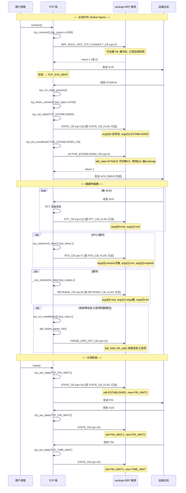
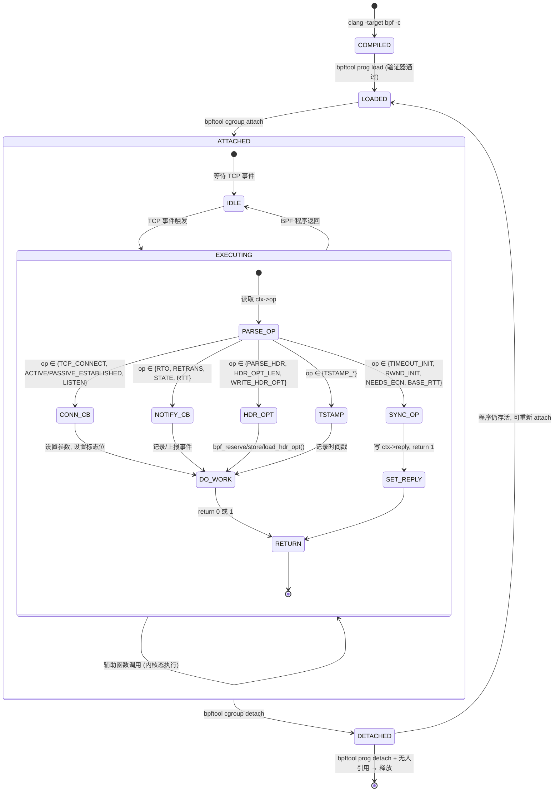

# 完整调用链与生命周期

> **💡 本章你将理解：**
> - 从 TCP 事件入口到 BPF 程序执行的完整树形调用栈，每个节点标注了精确的源码位置与入参语义
> - sockops 程序与 TCP 状态机的精确映射——每个状态跃迁触发什么回调
> - sockops 程序从 attach 到 detach 的完整生命周期状态机

---

## 一、树形调用栈全景：以 ACTIVE_ESTABLISHED_CB 为例

选取"主动端三次握手完成后触发 sockops"作为典型场景，展示从 TCP 栈入口到 BPF 程序执行、再到返回值消费的完整路径。

```
tcp_finish_connect()                                  [net/ipv4/tcp_input.c:6700]
  │  入参: sk 已迁移到 TCP_ESTABLISHED 的 socket
  │        skb = SYNACK 报文
  │
  ├── tcp_set_state(sk, TCP_ESTABLISHED)              [net/ipv4/tcp.c:6706]
  │     └── 若 STATE_CB_FLAG 已设置:
  │           tcp_call_bpf_2arg(sk, STATE_CB, oldstate, ESTABLISHED)
  │
  └── tcp_init_transfer(sk, ACTIVE_ESTABLISHED_CB, skb)  [net/ipv4/tcp.c:6715]
        │  入参: bpf_op=4, skb=SYNACK
        │  功能: 初始化拥塞窗口、MSS、窗口缩放，然后触发 sockops
        │
        ├── tcp_snd_cwnd_set(tp, tcp_init_cwnd(...))    [tcp_input.c:6690]
        │
        └── bpf_skops_established(sk, bpf_op, skb)        [tcp_input.c:6693]
              │  源码位置: net/ipv4/tcp_input.c:182
              │
              ├── sock_owned_by_me(sk)                   [tcp_input.c:187]
              │     └── 锁持有断言 (LOCKDEP 级别检查)
              │
              ├── memset(&sock_ops, 0, offsetof(..., temp))  [tcp_input.c:189]
              │     └── 将 kern 结构体前半部分归零
              │
              ├── sock_ops.op = BPF_SOCK_OPS_ACTIVE_ESTABLISHED_CB  [tcp_input.c:190]
              ├── sock_ops.is_fullsock = 1                             [tcp_input.c:191]
              ├── sock_ops.is_locked_tcp_sock = 1                      [tcp_input.c:192]
              ├── sock_ops.sk = sk                                     [tcp_input.c:193]
              │
              ├── bpf_skops_init_skb(&sock_ops, skb, tcp_hdrlen(skb)) [tcp_input.c:196]
              │     └── 设置 sock_ops.skb = skb
              │         设置 sock_ops.skb_data_end = skb->data + tcp_hdrlen
              │
              └── BPF_CGROUP_RUN_PROG_SOCK_OPS(&sock_ops)              [tcp_input.c:198]
                    │  宏展开: include/linux/bpf-cgroup.h:344
                    │
                    ├── cgroup_bpf_enabled(CGROUP_SOCK_OPS)   [bpf-cgroup.h:347]
                    │     └── static_branch 快速路径: 无 cgroup BPF → 直接返回 0
                    │
                    ├── __sk = sk_to_full_sk(sock_ops->sk)    [bpf-cgroup.h:348]
                    │     └── 从 request_sock 还原为完整 sock (若需要)
                    │
                    ├── sk_fullsock(__sk)                      [bpf-cgroup.h:349]
                    │     └── 确保是完整 socket (非 timewait)
                    │
                    └── __cgroup_bpf_run_filter_sock_ops(__sk, &sock_ops,
                                                          CGROUP_SOCK_OPS)
                          │  源码: kernel/bpf/cgroup.c:1721
                          │
                          ├── cgrp = sock_cgroup_ptr(&sk->sk_cgrp_data)
                          │     │  [kernel/bpf/cgroup.c:1725]
                          │     └── 从 socket 获取其所属 cgroup
                          │
                          └── bpf_prog_run_array_cg(&cgrp->bpf, CGROUP_SOCK_OPS,
                                                     sock_ops, bpf_prog_run, 0, NULL)
                                │  [kernel/bpf/cgroup.c:1727]
                                │
                                ├── 遍历 cgroup BPF 程序数组
                                │   (含层级继承: 父 cgroup 程序先执行)
                                │
                                └── 对每个程序:
                                      ├── BPF_PROG_RUN(prog, sock_ops)
                                      │     │  ctx = sock_ops (即 bpf_sock_ops_kern 的指针)
                                      │     │
                                      │     └── JIT 编译后的 BPF 程序执行:
                                      │           ├── ctx->op          → 读 sock_ops_kern.op
                                      │           ├── ctx->srtt_us    → JIT→ tcp_sock->srtt_us
                                      │           ├── ctx->is_fullsock → 读 sock_ops_kern.is_fullsock
                                      │           ├── ctx->state      → JIT→ sk->sk_state
                                      │           ├── ctx->skb_data   → JIT→ skb->data
                                      │           ├── bpf_setsockopt(ctx, ...)
                                      │           │     └── filter.c:5863: 操作 tcp_sock 参数
                                      │           ├── bpf_sock_ops_cb_flags_set(ctx, flags)
                                      │           │     └── filter.c:5999: 写 tp->bpf_sock_ops_cb_flags
                                      │           └── return 1 (事件已消费)
                                      │
                                      └── bpf_prog_run_array_cg 聚合:
                                            · ret = 0: 程序返回 0 → 继续下一个程序
                                            · ret = 1: 程序返回 1 → 终止遍历 (?? 非零即停)
                                            · 返回: 最终 ret 值
```

💡 **设计动机 —— `bpf_prog_run_array_cg` 的短路语义：** 当 cgroup 下挂载了多个 sockops 程序时（比如管理员和平台团队各挂了一个），执行顺序是**父 cgroup 程序先执行，子 cgroup 程序后执行**。当任意一个程序返回 `1`（非零）时，`bpf_prog_run_array_cg` 会**立即停止遍历**——后续程序不再执行。这意味着：**第一个返回 1 的程序"获胜"，拥有最终话语权。** 因此编写 sockops 程序时，如果有多个程序共存，必须约定清楚"谁负责返回 1"的协作协议。

---

## 二、完整 TCP 生命周期中的 sockops 调用时序



---

## 三、TCP 状态机与 sockops 回调的精确映射

```
                                BPF_SOCK_OPS_TIMEOUT_INIT ── 初始 RTO 计算
                                BPF_SOCK_OPS_RWND_INIT ── 初始接收窗口
                                BPF_SOCK_OPS_NEEDS_ECN ── ECN 需求判断
                                              │
                                              ▼
  ┌─────────┐  connect()   ┌─────────────┐  listen()  ┌──────────┐
  │  CLOSE  │─────────────→│  SYN_SENT    │            │  CLOSE   │
  └─────────┘              │              │            └────┬─────┘
                           │ TCP_CONNECT  │                 │listen()
                           │ _CB (op=3) ◄─│─ 订阅后续回调    │
                           │ 设置 IW/buf  │                 ▼
                           └──────┬───────┘          ┌──────────┐
                                  │                  │  LISTEN  │
                        收到 SYNACK                  │          │
                                  │                  │TCP_LISTEN│
                                  ▼                  │_CB (op=9)│
                           ┌─────────────┐           └────┬─────┘
                           │ ESTABLISHED │                │ 收到 SYN
                           │             │                ▼
                           │ ACTIVE_EST  │           ┌──────────┐
                           │ _CB (op=4)  │           │SYN_RECV  │
                           │ ◄─ skb_data  │           └────┬─────┘
                           │   = SYNACK   │                │收到 ACK
                           │ ◄─ 可切换CC  │                ▼
                           │ ◄─ 修改buf   │           ┌─────────────┐
                           │ ◄─ 插sockmap │           │ ESTABLISHED │
                           └──────┬───────┘           │             │
                                  │                   │PASSIVE_EST  │
                                  │                   │_CB (op=5)   │
                                  │                   │◄─ skb_data  │
                                  └───────┬───────────│  = ACK      │
                                          │           └──────┬──────┘
                                          │                  │
              ┌───────────────────────────┼──────────────────┼─────────────┐
              │           传输期间回调     │                  │             │
              │                           ▼                  ▼             │
              │  ┌──────────────┐  ┌──────────────┐  ┌──────────────┐      │
              │  │ RTT_CB (12)  │  │ RTO_CB (7)   │  │ RETRANS_CB(8)│      │
              │  │ 每 ACK 触发   │  │ 超时触发      │  │ 重传统计      │      │
              │  └──────────────┘  └──────────────┘  └──────────────┘      │
              │                                                             │
              │  ┌────────────────────┐  ┌────────────────────────────┐     │
              │  │ PARSE_HDR_OPT_CB   │  │ HDR_OPT_LEN_CB (13) →      │     │
              │  │ (11) 解析收包选项   │  │ WRITE_HDR_OPT_CB (14)       │     │
              │  └────────────────────┘  │ 预留空间 → 写入自定义选项    │     │
              │                          └────────────────────────────┘     │
              └─────────────────────────────────────────────────────────────┘

                        │  close() / 收到 FIN
                        ▼
              ┌─────────────────────────────────────────────┐
              │           关闭序列中，每次状态迁移触发:         │
              │              STATE_CB (op=10)                 │
              │                                              │
              │  ESTABLISHED → FIN_WAIT1  → FIN_WAIT2        │
              │           → TIME_WAIT → CLOSE   (主动)       │
              │  ESTABLISHED → CLOSE_WAIT → LAST_ACK → CLOSE │
              │                                (被动)        │
              └─────────────────────────────────────────────┘
```

⚠️ **易错点 —— 状态迁移的时序注意：**

在 `tcp_finish_connect()` 中（`tcp_input.c:6700-6715`），`tcp_set_state(ESTABLISHED)` 在 `tcp_init_transfer(ACTIVE_ESTABLISHED_CB)` **之前**调用。这意味着：

1. `STATE_CB`（如果已启用标志位）**先于** `ACTIVE_ESTABLISHED_CB` 触发
2. 进入 `ACTIVE_ESTABLISHED_CB` 时，`ctx->state` 已经是 `BPF_TCP_ESTABLISHED`
3. 但是！STATE_CB_FLAG 是在建连回调中设置的——首次建连时尚未设置，所以 STATE_CB 不会触发。只有**后续状态迁移**（如 FIN）才会触发 STATE_CB。

---

## 四、三条独立调度路径的完整调用链

sockops 在内核中存在**三条独立的调度路径**，各自有独立的函数和调用场景：

### 4.1 路径一：`tcp_call_bpf()` —— 主调度路径

```
tcp_call_bpf()                        [include/net/tcp.h:2905]
  │
  ├── 调用者列表:
  │   ├── tcp_connect()              → TCP_CONNECT_CB
  │   ├── tcp_timeout_init()         → TIMEOUT_INIT
  │   ├── tcp_rwnd_init_bpf()        → RWND_INIT
  │   ├── tcp_bpf_ca_needs_ecn()     → NEEDS_ECN
  │   ├── tcp_nv_init()              → BASE_RTT
  │   ├── tcp_set_state()            → STATE_CB
  │   ├── tcp_retransmit_timer()     → RTO_CB
  │   ├── __tcp_retransmit_skb()     → RETRANS_CB
  │   └── tcp_bpf_rtt()              → RTT_CB
  │
  ├── 特征: 填充完整 bpf_sock_ops_kern，通过 BPF_CGROUP_RUN_PROG_SOCK_OPS 调度
  └── 返回: reply 值 (同步操作) 或 忽略 (通知回调)
```

### 4.2 路径二：`bpf_skops_established()` —— 建连专用路径

```
bpf_skops_established()               [net/ipv4/tcp_input.c:182]
  │
  ├── 调用者:
  │   └── tcp_init_transfer()        → ACTIVE_ESTABLISHED_CB / PASSIVE_ESTABLISHED_CB
  │
  ├── 与 tcp_call_bpf() 的区别:
  │   ├── 直接构造 bpf_sock_ops_kern（不走 tcp_call_bpf 的 memset 逻辑）
  │   ├── 附带 skb 指针（bpf_skops_init_skb）
  │   └── 不使用 return 1/0 的 reply 消费逻辑（建连回调不期望返回值）
  │
  └── 动机: 建连时需要将 SYNACK/ACK 包的 TCP 头部暴露给 BPF 程序（skb_data）,
            而 tcp_call_bpf() 的通用接口不携带 skb。
```

### 4.3 路径三：`bpf_skops_tx_timestamping()` —— TX 时间戳路径

```
bpf_skops_tx_timestamping()           [net/core/sock.c:944]
  │
  ├── 调用者: socket 发送路径
  │   ├── TSTAMP_SCHED_CB → 设备层
  │   ├── TSTAMP_SND_SW_CB → 软件时间戳
  │   ├── TSTAMP_SND_HW_CB → 硬件时间戳
  │   ├── TSTAMP_ACK_CB   → ACK 确认
  │   └── TSTAMP_SENDMSG_CB → sendmsg 入口
  │
  ├── 独立于 tcp_call_bpf():
  │   ├── 直接调用 __cgroup_bpf_run_filter_sock_ops() (不经 BPF_CGROUP_RUN_PROG_SOCK_OPS)
  │   ├── 不持有 TCP 锁
  │   └── is_fullsock=1 直接硬编码
  │
  └── 启用: 需 socket 标志 SK_BPF_CB_TX_TIMESTAMPING
```

---

## 五、sockops 程序生命周期状态机



### 5.2 程序与 cgroup 的绑定生命周期

```
┌──────────────────────────────────────────────────────────────┐
│                     cgroup v2 层级                             │
│                                                              │
│  /sys/fs/cgroup/                          ← root cgroup       │
│  ├── sock_ops_prog_A (默认 RTO=200ms)                        │
│  │                                                           │
│  ├── system.slice/                                             │
│  │   ├── ss.service/                                          │
│  │   │   └── sock_ops_prog_B (覆盖 RTO=50ms)                 │
│  │   │                                                       │
│  │   └── db.service/                                          │
│  │       └── 无 sockops 程序 → 继承 system.slice 或 root     │
│  │                                                           │
│  └── user.slice/                                              │
│      └── 无 sockops 程序 → 继承 root cgroup 的策略            │
│                                                              │
│  核心规则:                                                     │
│  · 子 cgroup 可 attach 自己的程序 (覆盖父程序)                 │
│  · 父 cgroup 未设置程序 → 子 cgroup 向上继承最近祖先的程序     │
│  · 同一 cgroup 可 attach 多个程序 → 按 attach 顺序执行         │
│  · 进程迁移 cgroup → 新创建的 socket 归新 cgroup 管辖         │
│  · 已创建的 socket 不受进程迁移影响 (cgroup 在 socket 创建时绑定) │
└──────────────────────────────────────────────────────────────┘
```

💡 **设计动机 —— 为什么已创建的 socket 不受进程迁移影响？**
`sock_cgroup_ptr(&sk->sk_cgrp_data)` 在 socket 创建时（`sk_alloc()`）通过 `memcpy(&sk->cgrp_data, &current->cgrp_data, ...)` 固化。一旦分配完成，socket 的 cgroup 归属**不可改变**。这避免了"连接进行中被切换策略"导致的混乱（比如 ESTABLISHED 的连接突然换了 RTO 值），同时也简化了并发控制——`sk_cgrp_data` 无锁读取是安全的，因为它在 socket 生命周期内不变。

---

## 六、JIT 上下文访问：从 BPF 指令到内存访问的转换实例

以 BPF 程序中最常见的 `ctx->srtt_us` 读取为例，展示 `sock_ops_convert_ctx_access()` 如何将一次抽象字段访问重写为具体的内核结构体内存访问：

```
BPF 程序源码:
    u32 rtt = ctx->srtt_us;

BPF 字节码 (加载前):
    r1 = *(u32 *)(r2 + 80)   // offsetof(bpf_sock_ops, srtt_us) = 80

────────────────  sock_ops_convert_ctx_access() 介入 ────────────────
                          [net/core/filter.c:10888]
                     SOCK_OPS_GET_TCP_SOCK_FIELD(srtt_us)
                          [net/core/filter.c:10889]
───────────────────────  重写后的 JIT 代码  ─────────────────────────

    // 步骤 1: 检查 socket 锁持有状态
    r9 = *(u8 *)(r2 + 12)       // ctx->is_locked_tcp_sock (+12 in kern)
    if r9 == 0 goto zero_out

    // 步骤 2: 获取 tcp_sock 指针
    r1 = *(u64 *)(r2 + 0)       // ctx->sk (+0 in kern)

    // 步骤 3: 通过 tcp_sock 指针读取字段
    r1 = *(u32 *)(r1 + <tcp_sock.srtt_us_offset>)

    goto done

zero_out:
    r1 = 0                       // 若未持锁 → 返回 0

done:
```

🔒 **并发安全警示 —— 锁持有检查的代码化：** `is_locked_tcp_sock` 字段是在 `tcp_call_bpf()` 中被动设置的——它不是运行时检查锁状态，而是信任调用者已持有锁。`sock_owned_by_me(sk)` 的断言（仅在 `CONFIG_DEBUG_LOCKDEP` 时生效）用于开发调试。在正式内核中，JIT 代码的 `if (is_locked_tcp_sock)` 分支最终被编译为一条 `test+jne` 指令对——但这条检查的真实含义是"调用者是否遵守了契约"，而非动态锁检查。

---

> **📝 一句话回顾：** sockops 的完整调用链 = `tcp_call_bpf()` / `bpf_skops_established()` / `bpf_skops_tx_timestamping()` 三条路径 → `BPF_CGROUP_RUN_PROG_SOCK_OPS` 宏 → `__cgroup_bpf_run_filter_sock_ops` → `bpf_prog_run_array_cg` 遍历 cgroup 程序数组 → 每条 JIT 指令已被 `sock_ops_convert_ctx_access()` 重写为对 `struct sock` / `struct tcp_sock` / `struct sk_buff` 真实字段的直接内存访问——从 TCP 事件到 BPF 执行，中间没有系统调用、没有上下文切换、没有数据拷贝。

接下来请阅读 [`header-options.md`](./header-options.md)，深入理解 TCP 自定义头部选项的读写机制。
