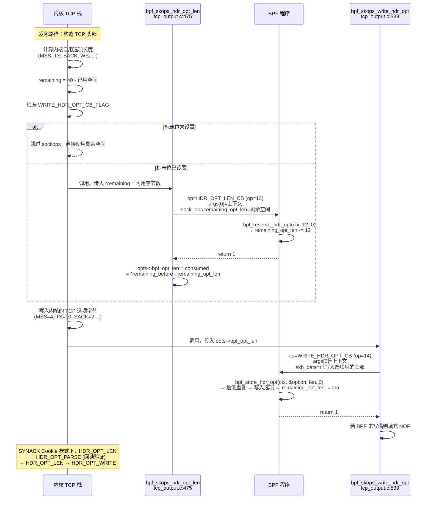

# TCP 自定义头部选项读写机制

> **💡 本章你将理解：**
> - sockops 如何在不修改内核 TCP 协议栈代码的前提下，向 TCP 包写入和解析自定义头部选项
> - 三阶段写流程（预留空间 → 写入选项 → NOP 填充）的逐行源码解剖
> - `bpf_reserve_hdr_opt` / `bpf_store_hdr_opt` / `bpf_load_hdr_opt` 三个辅助函数的完整实现细节
> - SYN Cookie 模式下头部选项的特殊处理路径

---

## 一、背景：TCP 头部选项的物理约束

TCP 头部选项区是 TCP 协议头中 20 字节固定头部之后的可变长区域：

```
┌──────────────────────────────────────────────────────────────┐
│                   TCP 头部 (最大 60 字节)                      │
│                                                              │
│  ┌───────────────────────┐  ┌────────────────────────────┐  │
│  │ 固定头部 (20 字节)     │  │ 选项区 (最多 40 字节)      │  │
│  │                       │  │                            │  │
│  │ SrcPort DstPort SeqN  │  │ [MSS] [SACK] [TS] [WS]    │  │
│  │ AckN Win Csum UrgPtr  │  │ [... 系统预留选项 ...]     │  │
│  │                       │  │ [... BPF 自定义选项 ...]   │  │
│  └───────────────────────┘  └────────────────────────────┘  │
│                              ↑                              │
│                     MAX_TCP_OPTION_SPACE = 40 bytes          │
└──────────────────────────────────────────────────────────────┘
```

选项遵循 TLV (Type-Length-Value) 编码：

```
┌────────┬────────┬───────────────────────┐
│  Kind  │  Len   │  Value                │
│  1 字节 │ 1 字节 │  Len - 2 字节          │
└────────┴────────┴───────────────────────┘
```

标淮选项 Kind 值（内核已占用部分）：MSS(2)、Window Scale(3)、SACK-permitted(4)、SACK(5)、Timestamp(8)。sockops 程序通常使用：
- `TCPOPT_EXP` (254)：RFC 6994 实验性选项 —— 需 2 或 4 字节的 Magic Number
- 253：另一个实验性 Kind
- 其他未被内核占用的自定义 Kind 值

⚠️ **易错点 —— 选项区空间是共享的：** 内核自己的 TCP 选项（MSS、Timestamp、SACK 等）也会占用这 40 字节。BPF 程序能使用的实际空间在每次 `HDR_OPT_LEN_CB` 回调中通过 `remaining_opt_len` 字段告知。典型可用空间约为 12-20 字节（取决于当时启用了哪些内核选项）。

---

## 二、三阶段写流程全景

向发出的 TCP 包写入自定义头部选项分为两阶段（空间预留 + 内容写入），由 `BPF_SOCK_OPS_WRITE_HDR_OPT_CB_FLAG` 统一启用：



---

## 三、空间预留：`bpf_skops_hdr_opt_len()` 逐行解剖

**源码位置：** `net/ipv4/tcp_output.c:475-537`

```c
static void bpf_skops_hdr_opt_len(struct sock *sk, struct sk_buff *skb,
                   struct request_sock *req, struct sk_buff *syn_skb,
                   enum tcp_synack_type synack_type,
                   struct tcp_out_options *opts,
                   unsigned int *remaining)
{
    struct bpf_sock_ops_kern sock_ops;
    int err;

    // ⑴ 快速路径：标志位未设置 或 剩余空间为 0 → 直接返回
    if (likely(!BPF_SOCK_OPS_TEST_FLAG(tcp_sk(sk),
                    BPF_SOCK_OPS_WRITE_HDR_OPT_CB_FLAG)) ||
        !*remaining)
        return;

    // ⑵ 填充 bpf_sock_ops_kern
    memset(&sock_ops, 0, offsetof(struct bpf_sock_ops_kern, temp));
    sock_ops.op = BPF_SOCK_OPS_HDR_OPT_LEN_CB;

    // ⑶ ⚠️ req!=NULL 时的特殊处理
    if (req) {
        // 将 sock_ops.sk 设为 request_sock，而非 listen sk
        // 原因：listen sk 未锁定，且对 listen sk 做 setsockopt 无意义
        sock_ops.sk = (struct sock *)req;
        sock_ops.syn_skb = syn_skb;
    } else {
        sock_owned_by_me(sk);
        sock_ops.is_fullsock = 1;
        sock_ops.is_locked_tcp_sock = 1;
        sock_ops.sk = sk;
    }

    // ⑷ args[0] 传递上下文信息
    sock_ops.args[0] = bpf_skops_write_hdr_opt_arg0(skb, synack_type);
    //   BPF_WRITE_HDR_TCP_CURRENT_MSS (skb==NULL)  → tcp_current_mss() 调用
    //   BPF_WRITE_HDR_TCP_SYNACK_COOKIE (synack cookie)→ SYN Cookie 模式
    //   0 (普通 SYN/数据包)                         → 标准发包

    // ⑸ 将当前剩余空间告知 BPF 程序
    sock_ops.remaining_opt_len = *remaining;

    // ⑹ 若有 skb，初始化 skb 相关字段
    if (skb)
        bpf_skops_init_skb(&sock_ops, skb, 0);

    // ⑺ 调用 cgroup BPF 程序（使用 SOCK_OPS_SK 变体——req 场景下用 listen sk 查 cgroup）
    err = BPF_CGROUP_RUN_PROG_SOCK_OPS_SK(&sock_ops, sk);

    // ⑻ 消费结果：计算 BPF 程序预留的总空间
    if (err || sock_ops.remaining_opt_len == *remaining)
        return;  // BPF 程序未预留空间 → 忽略

    // bpf_opt_len = BPF 程序消费的空间（字节数）
    opts->bpf_opt_len = *remaining - sock_ops.remaining_opt_len;

    // 向上对齐到 4 字节边界（TCP 要求）
    opts->bpf_opt_len = (opts->bpf_opt_len + 3) & ~3;

    // 从全局剩余空间中扣除
    *remaining -= opts->bpf_opt_len;
}
```

### 3.1 `bpf_skops_write_hdr_opt_arg0()` —— 上下文信息传递

**源码位置：** `net/ipv4/tcp_output.c:462-472`

```c
static int bpf_skops_write_hdr_opt_arg0(struct sk_buff *skb,
                    enum tcp_synack_type synack_type)
{
    if (unlikely(!skb))
        return BPF_WRITE_HDR_TCP_CURRENT_MSS;  // tcp_current_mss() 查询
    if (unlikely(synack_type == TCP_SYNACK_COOKIE))
        return BPF_WRITE_HDR_TCP_SYNACK_COOKIE; // SYN Cookie 模式
    return 0;
}
```

⚠️ **易错点 —— 三次调用，三种上下文：**

| `args[0]` 值 | 场景 | BPF 程序应如何处理 |
|---|---|---|
| `0` | 标准拨号/数据包 | 可以读取 skb_tcp_flags 判断是 SYN/ACK/DATA |
| `BPF_WRITE_HDR_TCP_CURRENT_MSS` | `tcp_current_mss()` 查询 | `skb_data` 不可用；空间最紧张；建议最小化选项 |
| `BPF_WRITE_HDR_TCP_SYNACK_COOKIE` | SYN Cookie 模式下写入 SYNACK | 选项在 Cookie 验证完成后可能**丢失**；需在 active 端回读自己的选项 |

💡 **设计动机 —— 为什么 MSS 查询也要触发 HDR_OPT_LEN_CB？** 
`tcp_current_mss()` 在计算当前 MSS 时需要知道实际 TCP 头部长度。如果 BPF 程序打算在后续数据包中写入自定义选项，这些选项的长度必须在此刻被计入 MSS 计算，否则 IP 分片可能发生。因此内核在 MSS 计算路径上也触发了 `HDR_OPT_LEN_CB`，让 BPF 程序有机会声明"我将来会使用 X 字节的选项空间"。

---

## 四、内容写入：`bpf_skops_write_hdr_opt()` 逐行解剖

**源码位置：** `net/ipv4/tcp_output.c:539-582`

```c
static void bpf_skops_write_hdr_opt(struct sock *sk, struct sk_buff *skb,
                    struct request_sock *req, struct sk_buff *syn_skb,
                    enum tcp_synack_type synack_type,
                    struct tcp_out_options *opts)
{
    u8 first_opt_off, nr_written, max_opt_len = opts->bpf_opt_len;
    struct bpf_sock_ops_kern sock_ops;
    int err;

    // ⑴ 无预留空间 → 不调用 BPF
    if (likely(!max_opt_len))
        return;

    // ⑵ 填充 kern 结构体 (同 HDR_OPT_LEN_CB)
    memset(&sock_ops, 0, offsetof(struct bpf_sock_ops_kern, temp));
    sock_ops.op = BPF_SOCK_OPS_WRITE_HDR_OPT_CB;

    // ⑶ req 处理 (同 HDR_OPT_LEN_CB)
    if (req) { /* ... */ } else { /* ... */ }

    sock_ops.args[0] = bpf_skops_write_hdr_opt_arg0(skb, synack_type);

    // ⑷ ⚠️ remaining_opt_len 语义变化
    //    HDR_OPT_LEN_CB: remaining = TCP 选项区总可用空间
    //    WRITE_HDR_OPT_CB: remaining = BPF 程序在 LEN 阶段预留的空间
    sock_ops.remaining_opt_len = max_opt_len;

    // ⑸ 计算 BPF 选项区的起始偏移
    first_opt_off = tcp_hdrlen(skb) - max_opt_len;
    //  skb_data 仅指向 BPF 选项区 (不包含内核写入的部分)
    bpf_skops_init_skb(&sock_ops, skb, first_opt_off);

    err = BPF_CGROUP_RUN_PROG_SOCK_OPS_SK(&sock_ops, sk);

    // ⑹ 计算实际写入的字节数
    if (err)
        nr_written = 0;
    else
        nr_written = max_opt_len - sock_ops.remaining_opt_len;

    // ⑺ ⚠️ 未写入的空间用 NOP 填充
    //    TCP 协议要求选项区完整覆盖——不能有未初始化的空隙
    if (nr_written < max_opt_len)
        memset(skb->data + first_opt_off + nr_written, TCPOPT_NOP,
               max_opt_len - nr_written);
}
```

🔒 **并发安全警示 —— NOP 填充的生命：**
如果 BPF 程序在 `WRITE_HDR_OPT_CB` 中预留了空间但没有写满（或写入的字节少于预留量），剩余的字节会被内核**强制填充为 TCPOPT_NOP (0x01)**。这不是可选的美化——TCP 协议要求选项区从第一个 Kind 字段到 EOL 之间必须是合法选项序列。未初始化的内存暴露在线路上是协议违例，更糟糕的可能是信息泄露。

---

## 五、三个辅助函数的完整实现

### 5.1 `bpf_sock_ops_reserve_hdr_opt()` —— 预留空间

**源码位置：** `net/core/filter.c:7965-7980`

```c
BPF_CALL_3(bpf_sock_ops_reserve_hdr_opt,
           struct bpf_sock_ops_kern *, bpf_sock,
           u32, len, u64, flags)
{
    // 仅在 HDR_OPT_LEN_CB 操作中有效
    if (bpf_sock->op != BPF_SOCK_OPS_HDR_OPT_LEN_CB)
        return -EPERM;

    if (flags || len < 2)
        return -EINVAL;

    if (len > bpf_sock->remaining_opt_len)
        return -ENOSPC;

    // ⚠️ 直接递减 remaining_opt_len，不写入任何数据
    bpf_sock->remaining_opt_len -= len;
    return 0;
}
```

**语义：** `bpf_reserve_hdr_opt()` 声明"我预留了 `len` 字节"，但此时不产生任何字节输出。返回值 0 表示预留成功，`-ENOSPC` 表示空间不足。

### 5.2 `bpf_sock_ops_store_hdr_opt()` —— 写入选项

**源码位置：** `net/core/filter.c:7887-7953`

```c
BPF_CALL_4(bpf_sock_ops_store_hdr_opt,
           struct bpf_sock_ops_kern *, bpf_sock,
           const void *, from, u32, len, u64, flags)
{
    u8 new_kind, new_kind_len, magic_len = 0, *opend;
    const u8 *op, *new_op, *magic = NULL;
    struct sk_buff *skb;
    bool eol;

    // ⑴ 仅在 WRITE_HDR_OPT_CB 操作中有效
    if (bpf_sock->op != BPF_SOCK_OPS_WRITE_HDR_OPT_CB)
        return -EPERM;

    if (len < 2 || flags)
        return -EINVAL;

    // ⑵ 解析要写入的选项
    new_op = from;
    new_kind = new_op[0];          // Kind
    new_kind_len = new_op[1];      // 总长度
    if (new_kind_len > len || new_kind == TCPOPT_NOP ||
        new_kind == TCPOPT_EOL)
        return -EINVAL;

    if (new_kind_len > bpf_sock->remaining_opt_len)
        return -ENOSPC;

    // ⑶ 实验性选项 (TCPOPT_EXP=254 或 253) 需要 magic number
    //    用于后续的去重检测
    if (new_kind == TCPOPT_EXP || new_kind == 253) {
        if (new_kind_len < 4)
            return -EINVAL;
        magic = &new_op[2];
        magic_len = 2;   // ⚠️ 只匹配 2 字节 magic (保守策略)
    }

    // ⑷ ⚠️ 去重检查 —— 同一 SKB 中不能写入两个相同 Kind+Magic 的选项
    skb = bpf_sock->skb;
    op = skb->data + sizeof(struct tcphdr);
    opend = bpf_sock->skb_data_end;
    op = bpf_search_tcp_opt(op, opend, new_kind, magic, magic_len, &eol);
    if (!IS_ERR(op))
        return -EEXIST;           // 已存在相同选项 → 拒绝写入

    if (PTR_ERR(op) != -ENOMSG)
        return PTR_ERR(op);

    if (eol)
        // ⚠️ 选项区已结束 → 无更多空间
        return -ENOSPC;

    // ⑸ 写入选项字节
    memcpy(opend, from, new_kind_len);

    // ⑹ 更新 remaining_opt_len 和 skb_data_end
    bpf_sock->remaining_opt_len -= new_kind_len;
    bpf_sock->skb_data_end += new_kind_len;

    return 0;
}
```

💡 **设计动机 —— 去重检查：** 内核在 BPF 之前已经写入了自己的选项。如果 BPF 程序试图写入一个 Kind 值与内核选项冲突的选项（比如重复写入 MSS），去重检查会拒绝。这防止了 BPF 程序意外破坏内核 TCP 语义。实验性选项（254/253）的去重只匹配 `Kind + 2字节 Magic`，这是 RFC 6994 兼容行为——同一 Magic 的下一个选项被视为重复。

### 5.3 `bpf_sock_ops_load_hdr_opt()` —— 读取选项

**源码位置：** `net/core/filter.c:7806-7875`

```c
BPF_CALL_4(bpf_sock_ops_load_hdr_opt,
           struct bpf_sock_ops_kern *, bpf_sock,
           void *, search_res, u32, len, u64, flags)
{
    bool eol, load_syn = flags & BPF_LOAD_HDR_OPT_TCP_SYN;
    const u8 *op, *opend, *magic, *search = search_res;
    u8 search_kind, search_len, copy_len, magic_len;
    int ret;

    if (!is_locked_tcp_sock_ops(bpf_sock))
        return -EOPNOTSUPP;

    // ⑴ 参数校验
    if (len < 2 || flags & ~BPF_LOAD_HDR_OPT_TCP_SYN)
        return -EINVAL;

    search_kind = search[0];
    search_len = search[1];
    if (search_len > len || search_kind == TCPOPT_NOP ||
        search_kind == TCPOPT_EOL)
        return -EINVAL;

    // ⑵ 实验性选项需 magic 匹配
    if (search_kind == TCPOPT_EXP || search_kind == 253) {
        if (search_len != 4 && search_len != 6)
            return -EINVAL;
        magic = &search[2];
        magic_len = search_len - 2;
    } else {
        if (search_len)
            return -EINVAL;
        magic = NULL;
        magic_len = 0;
    }

    // ⑶ 数据来源选择：SYN 保存区 vs 当前 skb
    if (load_syn) {
        // BPF_LOAD_HDR_OPT_TCP_SYN: 从保存的 SYN 包中读取
        ret = bpf_sock_ops_get_syn(bpf_sock, TCP_BPF_SYN, &op);
        if (ret < 0)
            return ret;
        opend = op + ret;
        op += sizeof(struct tcphdr);  // 跳过 TCP 固定头部
    } else {
        // 标准路径: 从当前 skb 的 TCP 头部中读取
        if (!bpf_sock->skb ||
            bpf_sock->op == BPF_SOCK_OPS_HDR_OPT_LEN_CB)
            return -EPERM;
        opend = bpf_sock->skb_data_end;
        op = bpf_sock->skb->data + sizeof(struct tcphdr);
    }

    // ⑷ 在选项区中搜索匹配的选项
    op = bpf_search_tcp_opt(op, opend, search_kind, magic, magic_len, &eol);
    if (IS_ERR(op))
        return PTR_ERR(op);

    // ⑸ 复制找到的选项到 BPF 程序提供的缓冲区
    copy_len = op[1];
    ret = copy_len;
    if (copy_len > len) {
        ret = -ENOSPC;       // 缓冲区太小 → 截断复制
        copy_len = len;
    }
    memcpy(search_res, op, copy_len);
    return ret;
}
```

⚠️ **易错点 —— `BPF_LOAD_HDR_OPT_TCP_SYN` 标志的用途：**
在被动端（server）处理 SYN 时，SYN 包可能因 SYN Cookie 未被保存。此时必须使用 `load_syn=1` 标志，让 `bpf_load_hdr_opt()` 通过 `bpf_sock_ops_get_syn()` 从 `req->saved_syn` 或 `TCP_SAVED_SYN` 存储中获取 SYN 包的内容。在主动端（client），建连期间收到的 SYNACK 在 `ACTIVE_ESTABLISHED_CB` 中通过 `skb_data` 可用。

---

## 六、解析收包选项：`bpf_skops_parse_hdr()`

**源码位置：** `net/ipv4/tcp_input.c:147-180`

```c
static void bpf_skops_parse_hdr(struct sock *sk, struct sk_buff *skb)
{
    // ⑴ 两个触发条件 (任一为真即触发)
    bool unknown_opt = tcp_sk(sk)->rx_opt.saw_unknown &&
        BPF_SOCK_OPS_TEST_FLAG(tcp_sk(sk),
                    BPF_SOCK_OPS_PARSE_UNKNOWN_HDR_OPT_CB_FLAG);
    bool parse_all_opt = BPF_SOCK_OPS_TEST_FLAG(tcp_sk(sk),
                         BPF_SOCK_OPS_PARSE_ALL_HDR_OPT_CB_FLAG);

    // ⑵ 无触发条件 → 跳过
    if (likely(!unknown_opt && !parse_all_opt))
        return;

    // ⑶ 非稳定状态不触发
    switch (sk->sk_state) {
    case TCP_SYN_RECV:
    case TCP_SYN_SENT:
    case TCP_LISTEN:
        return;   // 握手阶段由建连回调负责
    }

    // ⑷ 只在 ESTABLISHED 等稳定状态触发
    memset(&sock_ops, 0, offsetof(struct bpf_sock_ops_kern, temp));
    sock_ops.op = BPF_SOCK_OPS_PARSE_HDR_OPT_CB;
    sock_ops.is_fullsock = 1;
    sock_ops.is_locked_tcp_sock = 1;
    sock_ops.sk = sk;
    bpf_skops_init_skb(&sock_ops, skb, tcp_hdrlen(skb));
    BPF_CGROUP_RUN_PROG_SOCK_OPS(&sock_ops);
}
```

| 标志位 | 触发条件 | 使用场景 |
|---|---|---|
| `PARSE_ALL_HDR_OPT_CB_FLAG` | 每个收到的有选项的包都触发 | 监控所有 TCP 选项（包括内核已知的） |
| `PARSE_UNKNOWN_HDR_OPT_CB_FLAG` | 仅当内核遇到无法识别的选项时触发 | 仅处理自定义/实验性选项，避免不必要开销 |

💡 **设计动机 —— 为什么要有两个解析标志？**
`PARSE_ALL` 昂贵——每个带选项的收包都进 BPF。`PARSE_UNKNOWN` 高效——内核在遍历选项时用一个 `saw_unknown` 布尔标记来指示是否遇到未知选项，只在"有需要让 BPF 看的"内容时才触发回调。生产环境中推荐用 `PARSE_UNKNOWN`。

---

## 七、SYN Cookie 模式下的头部选项回环

SYN Cookie 是 TCP 防御 SYN Flood 攻击的机制——server 不保存 SYN 包的状态，而是将必要的连接信息编码进返回的 SYNACK 序列号中。

**这对头部选项的影响：**

```
1. 首次 SYNACK (Cookie 模式):
   client → SYN ──────────────────────→ server
   client ← SYNACK (含 Cookie) ──────── server
                ↑
         HDR_OPT_LEN_CB (args[0]=SYNACK_COOKIE)
         HDR_OPT_WRITE_CB (args[0]=SYNACK_COOKIE)
         ⚠️ 此时写入的选项在后续可能丢失

2. Cookie 验证失败 → 重新生成:
   client → ACK (含 Cookie) ──────────→ server
   server 验证 Cookie ← 从 ACK 重建连接状态
   client ← SYNACK (重新生成，可能不带 BPF 选项) ← server
                ↑
         再次触发 HDR_OPT_LEN_CB + WRITE

3. SYN Cookie + active 端回读:
   active 端在 SYN Cookie 场景下应将 PARSE_ALL_HDR_OPT_CB_FLAG 保留打开
   → 每次收到 SYNACK 都回读自己发送的选项
   → 若发现 SYNACK 不含自己的选项 → 重传选项 (通过重传逻辑)
```

⚠️ **易错点 —— SYN Cookie 模式下选项的丢失风险：** 
`BPF_WRITE_HDR_TCP_SYNACK_COOKIE` 模式下写入的选项在 Cookie 验证通过、连接升级为完整 ESTABLISHED 后可能**不被保留**（因为连接的 SYN 包数据从未存储）。推荐的做法是：**在被动端的 ACTIVE_ESTABLISHED_CB 中不使用头部选项做关键决策；所有关键信息通过 `bpf_setsockopt` 写入即可，不依赖 SYN Cookie 路径下的选项持久化。**

---

## 八、`remaining_opt_len` 的跨阶段状态机

```
                                 HDR_OPT_LEN_CB
                                      │
              remaining_opt_len = TCP选项区总可用空间 (如 12)
                                      │
                ┌─────────────────────┤
                │                     │
       bpf_reserve_hdr_opt(4)    bpf_reserve_hdr_opt(8)
       remaining -= 4            remaining -= 8
       remaining → 8             remaining → 4
                │                     │
                └─────────────────────┘
                                      │
                        opts->bpf_opt_len = 12 (对齐后)
                                      │
                                      ▼
                              WRITE_HDR_OPT_CB
                                      │
              remaining_opt_len = bpf_opt_len (即 12)
                                      │
                ┌─────────────────────┤
                │                     │
       bpf_store_hdr_opt(optA, 6)  bpf_store_hdr_opt(optB, 4)
       remaining -= 6              remaining -= 4
       remaining → 6               remaining → 2
                │                     │
                └─────────────────────┘
                                      │
                        nr_written = 10 (共写入 10 字节)
                        剩余 2 字节 → 填充 TCPOPT_NOP
```

---

## 九、完整示例：自定义实验性选项的读写

以下是从 `tools/testing/selftests/bpf/progs/test_tcp_hdr_options.c` 提取的简化示例：

```c
// 自定义选项结构
struct tcp_exprm_opt {
    __u8  kind;    // TCPOPT_EXP = 254
    __u8  len;     // 总字节数
    __u16 magic;   // 实验性 magic number (0xeB9F)
    __u8  data[4]; // 载荷
};

SEC("sockops")
int handle_hdr_options(struct bpf_sock_ops *skops)
{
    struct tcp_exprm_opt opt;
    int err;

    switch (skops->op) {
    case BPF_SOCK_OPS_HDR_OPT_LEN_CB:
        // 预留 8 字节空间 (2 kind+len + 2 magic + 4 data)
        err = bpf_reserve_hdr_opt(skops, 8, 0);
        if (err)
            return 1;
        break;

    case BPF_SOCK_OPS_WRITE_HDR_OPT_CB:
        // 写入自定义选项
        opt.kind = TCPOPT_EXP;
        opt.len = 8;
        opt.magic = __bpf_htons(0xeB9F);
        opt.data[0] = 0x42;  // 自定义数据
        err = bpf_store_hdr_opt(skops, &opt, 8, 0);
        break;

    case BPF_SOCK_OPS_PARSE_HDR_OPT_CB:
        // 读取自定义选项
        opt.kind = TCPOPT_EXP;
        opt.len = 4;    // 仅搜索kind+len+magic匹配
        opt.magic = __bpf_htons(0xeB9F);
        err = bpf_load_hdr_opt(skops, &opt, 8, 0);
        if (err >= 4) {
            // 选项已找到，opt.data[] 中包含载荷
            bpf_printk("got custom option: data=%x\n", opt.data[0]);
        }
        break;

    default:
        break;
    }
    return 1;
}

// 在建连时启用头部选项回调
SEC("sockops")
int enable_hdr(struct bpf_sock_ops *skops)
{
    if (skops->op == BPF_SOCK_OPS_ACTIVE_ESTABLISHED_CB ||
        skops->op == BPF_SOCK_OPS_PASSIVE_ESTABLISHED_CB)
    {
        bpf_sock_ops_cb_flags_set(skops,
            BPF_SOCK_OPS_PARSE_UNKNOWN_HDR_OPT_CB_FLAG |
            BPF_SOCK_OPS_WRITE_HDR_OPT_CB_FLAG);
    }
    return 1;
}
```

---

> **📝 一句话回顾：** 头部选项机制 = `remaining_opt_len` 跨两阶段状态机（LEN 预留 + WRITE 写入）→ 内核在 BPF 之后填充 NOP 保证协议安全 → `bpf_search_tcp_opt()` 帮助查找匹配选项（去重/加载共用）→ SYN Cookie 模式下选项可能丢失，关键策略应通过 `bpf_setsockopt` 而非选项传递。

接下来请阅读 [`sockmap-integration.md`](./sockmap-integration.md)，理解 sockops 如何与 sockmap 联动实现内核态四层负载均衡。
