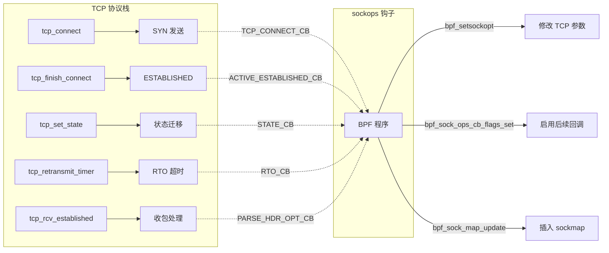

# 引言：为什么需要 sockops？

> **💡 本章你将理解：**
> - 在 sockops 诞生前，内核 TCP 参数调优面临什么致命缺陷？
> - 为什么说 sockops 是"TCP 状态机上的可编程传感器与操纵杆"？
> - 阅读本分册需要哪些前提知识？

---

## 一、历史背景：TCP 调优的三次范式跃迁

### 1.1 蛮荒时代：全局 sysctl

Linux 内核的第一个 TCP 实现（1990 年代初期）将 TCP 参数——RTO 最小值、拥塞窗口初始值、读写缓冲区大小——硬编码为编译时常量或全局 `sysctl` 变量。

**致命缺陷：**

```
                    ┌──────────────┐
                    │  sysctl 全局 │
                    │  net.ipv4.   │
                    │  tcp_rto_min │
                    └──────┬───────┘
                           │ 一个值对所有 socket 生效
              ┌────────────┼────────────┐
              ▼            ▼            ▼
         ┌─────────┐ ┌─────────┐ ┌─────────┐
         │ 同机房   │ │ 跨大洲   │ │ 移动网络 │
         │ RTT=1ms  │ │RTT=200ms│ │ RTT=50ms │
         └─────────┘ └─────────┘ └─────────┘
              全部使用同一个 RTO 最小值
```

同机房连接只需要 10ms 级的 RTO，但为了兼容跨洲连接，管理员只能将 `tcp_rto_min` 设为一个"折中值"（源码中为 `TCP_RTO_MIN = 200ms`，定义于 `include/net/tcp.h`）。结果是：同机房连接因不必要的长时间等待重传而浪费延迟，跨洲连接又可能因 RTO 过小而过度重传。

更根本的问题在于：**sysctl 是"空间无关"的**——它无法根据每条连接的实际情况（源/目的 IP、端口、cgroup 归属）做出差异化决策。

### 1.2 用户态代理时代：BPF_CGROUP_INET{4,6}_*

Linux 4.x 引入了 cgroup BPF 程序类型 `BPF_PROG_TYPE_CGROUP_SOCK` 和 `BPF_CGROUP_INET4_CONNECT` 等挂载点（定义于 `include/uapi/linux/bpf.h`），允许在 `connect()` / `bind()` / `sendmsg()` / `recvmsg()` 系统调用时触发 BPF 程序执行。

这解决了"空间感知"问题——BPF 程序可以读取源/目的 IP 和端口，按需决策。但它引出了**新的致命缺陷**：

**缺陷一：建连时间点的信息匮乏**

```c
// CGROUP_SOCK 程序在 connect() 时能看到什么？
struct bpf_sock *sk = ctx->sk;  // socket 基本信息
// ⚠️ 缺失：TCP 状态机信息（当前在哪个状态？）
// ⚠️ 缺失：RTT 测量值（还没有数据包，自然没有 RTT）
// ⚠️ 缺失：拥塞窗口、重传统计等运行态参数
// ⚠️ 缺失：TCP 头部选项读写能力
```

建连时刻能获取的信息仅限于 socket 层的通用字段（家族、协议、IP/端口），TCP 层的关键运行参数（RTT、拥塞窗口、状态机位置）完全不可见。

**缺陷二：建连后无法介入**

更致命的是：一旦 `connect()` 调用返回，cgroup sock 程序就无法再对该连接施加影响了。当 RTO 超时实际触发时、当连接状态在 `TIME_WAIT` 和 `CLOSE_WAIT` 之间迁移时、当每个 RTT 被测量时——这些 TCP 栈内部事件对 BPF 程序来说是**盲点**。

```
connect() 时刻:       [BPF 程序可介入]
       |
       v
    建连后的 TCP 生命周期:
       ├── RTO 超时触发          [BPF 盲点]
       ├── 重传发生              [BPF 盲点]
       ├── ESTABLISHED→FIN_WAIT1 [BPF 盲点]
       ├── RTT 更新              [BPF 盲点]
       └── 收到 TCP 自定义选项    [BPF 盲点]
```

### 1.3 sockops 时代：TCP 协议栈内置钩子（Linux 4.13+）

2017 年，Linux 4.13 引入了 `BPF_PROG_TYPE_SOCK_OPS`（源码定义于 `include/uapi/linux/bpf.h:1074`），彻底改变了上述局面。

**核心突破：将 BPF 程序直接嵌入 TCP 协议栈内部。**



sockops 将钩子植入 TCP 协议栈的动作本身（tcp_connect、tcp_finish_connect、tcp_set_state）而非系统调用入口。这意味着 BPF 程序能够：

1. **在 TCP 栈的"决策瞬间"介入**：`TCP_CONNECT_CB` 在 SYN 即将发出前触发，此时可以修改拥塞窗口初始值；`ACTIVE_ESTABLISHED_CB` 在三次握手完成后立即触发，此时可以修改缓冲区大小或启用后续通知回调
2. **访问 TCP 层运行时数据**：`srtt_us`（平滑 RTT）、`snd_cwnd`（拥塞窗口）、`packets_out`（在途报文数）等字段在 BPF 上下文中直接可读
3. **订阅后续事件流**：通过 `bpf_sock_ops_cb_flags_set()` 设置回调标志位，可以在 RTO 超时、状态迁移、每次 RTT 测量时收到异步通知
4. **按 cgroup 维度管理**：sockops 附加到 cgroup 上，继承 cgroup 的层级管理能力——父 cgroup 的程序自动影响所有子 cgroup 的 TCP 连接

---

## 二、sockops 解决的核心矛盾

```
┌──────────────────────────────────────────────────────────────┐
│                     核心矛盾                                  │
│                                                              │
│   TCP 连接需要按“连接属性”做差异化调优                          │
│           ↕                                                   │
│   但调优所需的决策信息在 TCP 栈内部，不在用户态可见             │
│           ↕                                                   │
│   解决方案：将调优逻辑下沉到 TCP 栈内部执行                      │
│           ↕                                                   │
│   ===> sockops：运行在 TCP 栈内的可编程策略引擎                 │
└──────────────────────────────────────────────────────────────┘
```

### 2.1 具体解决的四大痛点

| 痛点 | sockops 之前的方案 | sockops 方案 |
|---|---|---|
| **差异化 TCP 参数** | sysctl 全局 — 一根筋 | 每连接可在建连时通过 `bpf_setsockopt` 设置；同步操作码（`TIMEOUT_INIT` 等）直接返回参数值 |
| **建连后持续介入** | 不可能 — connect() 之后就是盲区 | 通知回调机制：订阅 `RTO_CB` / `STATE_CB` / `RTT_CB` 持续获取事件 |
| **自定义 TCP 选项** | 需修改内核源码 | `HDR_OPT_LEN_CB` + `WRITE_HDR_OPT_CB` + `PARSE_HDR_OPT_CB` 三件套 |
| **连接级负载均衡** | 需第三方代理（如 IPVS）做连接分发 | 建连时将 socket 自动插入 sockmap，配合 sk_skb 程序实现内核态四层代理 |

---

## 三、前置知识指引

阅读本分册前，你应当在以下领域具备基础知识。若对某个概念不熟，建议先补阅读对应的内核文档。

### 3.1 BPF 最小知识集合

| 概念 | 你需要理解到什么程度 | 补充阅读 |
|---|---|---|
| BPF 程序类型 (`bpf_prog_type`) | 不同程序类型决定了可访问的上下文和辅助函数；sockops 是其中一种，附着于 cgroup | `Documentation/bpf/libbpf/` |
| BPF map | KV 存储，用于 BPF 程序间共享数据、跨事件传递状态；sockops 常用 sockmap/sockhash 存储 socket 引用 | `Documentation/bpf/maps.rst` |
| BPF 辅助函数 | 程序可调用的内核函数白名单；sockops 能调用 `bpf_setsockopt`、`bpf_sock_ops_cb_flags_set` 等 | `include/uapi/linux/bpf.h` 辅助函数 ID 枚举 |
| BPF 验证器 | 加载时静态检查：禁止越界访问、循环、不可达指令；理解"验证器友好"的编程范式 | `Documentation/bpf/verifier.rst` |
| `libbpf` 加载模型 | `SEC()` 宏标记程序节、`bpf_object__open` → `bpf_object__load` → `bpf_program__attach` 三步曲 | `tools/lib/bpf/README.rst` |

### 3.2 TCP 最小知识集合

| 概念 | 你需要理解到什么程度 | 关键源码 |
|---|---|---|
| TCP 状态机 | CLOSED → LISTEN → SYN_RECV → ESTABLISHED → FIN_WAIT → CLOSED 的完整生命周期 | `include/net/tcp_states.h` |
| 三次握手 | SYN → SYN+ACK → ACK 的时序和 socket 状态迁移（主动/被动打开的区别） | `net/ipv4/tcp_input.c:tcp_rcv_state_process()` |
| RTO (Retransmission Timeout) | TCP 重传超时机制：RTO 定时器、指数退避、tcp_retransmit_timer 处理函数 | `net/ipv4/tcp_timer.c` |
| 拥塞窗口与慢启动 | `snd_cwnd` 的增减逻辑、ssthresh 阈值、拥塞控制算法可插拔机制 | `net/ipv4/tcp_cong.c` |
| TCP 头部选项格式 | Kind(1B) + Length(1B) + Value 的 TLV 编码格式、选项空间限制（40 字节最大选项区） | RFC 9293 第 3.2 节 |

⚠️ **易错点**：如果你对 TCP 状态机不熟悉，务必先阅读 `include/net/tcp_states.h` 中的状态枚举和 `net/ipv4/tcp.c:tcp_set_state()` 的状态迁移逻辑。sockops 的 `STATE_CB` 回调、`TIMEOUT_INIT` 操作、建连回调都精确绑定在特定状态上——不理解状态机将导致无法预期程序何时被触发。

### 3.3 cgroup v2 最小知识集合

| 概念 | 你需要理解到什么程度 |
|---|---|
| cgroup 层级结构 | 子 cgroup 继承父 cgroup 的资源限制和 BPF 程序；sockops 在 cgroup 层级上生效 |
| cgroup BPF 挂载 | `bpftool cgroup attach` 命令；程序附着于 cgroup 目录，影响该 cgroup 内所有进程创建的 socket |
| cgroup socket 归属判定 | socket 创建时继承进程的当前 cgroup；sockops 通过 `BPF_CGROUP_RUN_PROG_SOCK_OPS` 宏查找 socket 所属 cgroup |

---

## 四、sockops 在内核中的定位

```
用户态
  │  open() / write()  等系统调用
  ▼
────────────────────── 系统调用层 ──────────────────────
  │
  ▼
VFS / Socket 层 (net/socket.c)
  │  socket->ops->connect() / sendmsg() 等
  ▼
TCP 协议层 (net/ipv4/tcp.c, tcp_input.c, tcp_output.c, tcp_timer.c)
  │
  │  sockops 钩子就是插在这一层的：
  │  · tcp_connect() → BPF_SOCK_OPS_TCP_CONNECT_CB
  │  · tcp_finish_connect() → BPF_SOCK_OPS_ACTIVE_ESTABLISHED_CB
  │  · tcp_set_state() → BPF_SOCK_OPS_STATE_CB
  │  · tcp_retransmit_timer() → BPF_SOCK_OPS_RTO_CB
  │  · tcp_rcv_established() → bpf_skops_parse_hdr()
  │
  ├──→ tcp_call_bpf() [include/net/tcp.h:2905]
  ├──→ BPF_CGROUP_RUN_PROG_SOCK_OPS() [include/linux/bpf-cgroup.h:344]
  ├──→ __cgroup_bpf_run_filter_sock_ops() [kernel/bpf/cgroup.c:1721]
  └──→ BPF 程序执行 ◄── 你的 sockops 程序
  │
  │  BPF 辅助函数（在 sockops 上下文中可用）：
  │  · bpf_setsockopt() [net/core/filter.c:5863]
  │  · bpf_getsockopt() [net/core/filter.c:5957]
  │  · bpf_sock_ops_cb_flags_set() [net/core/filter.c:5999]
  │  · bpf_sock_map_update() → 关联 sockmap
  │  · bpf_load_hdr_opt() / bpf_store_hdr_opt() → 自定义头部选项
  │
  ▼
IP 层 → 链路层 → 硬件
```

sockops 不拦截也不修改网络数据包本身（那是 `BPF_PROG_TYPE_SOCKET_FILTER` 或 XDP 的工作）。它修改的是 **TCP 连接的运行时参数**：拥塞窗口、RTO 值、缓冲区大小、回调订阅。

---

## 五、本书阅读约定

全书使用以下标注规范：

| 标注标记 | 含义 |
|---|---|
| `函数名 @ 文件路径:行号` | 内核源码函数的精确位置标注 |
| ⚠️ **易错点** | 容易误解或踩坑的设计细节 |
| 💡 **设计动机** | 解释为什么内核选择当前的实现方式 |
| 🔒 **并发安全警示** | 涉及锁、RCU、引用计数的安全语义 |

---

> **📝 一句话回顾：** sockops 是嵌在 TCP 协议栈事件驱动点上的 BPF 钩子，不是包过滤器，而是连接级的"智能传感器与参数控制器"，它通过 cgroup 施加策略，在三次握手、状态迁移、重传超时等关键决策瞬间让策略生效。

接下来请阅读 [`design-and-data.md`](./design-and-data.md)，深入解剖 sockops 的核心数据结构与设计哲学。
