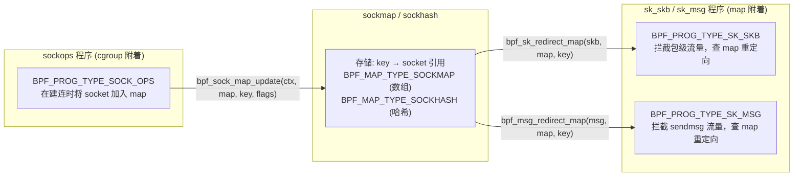
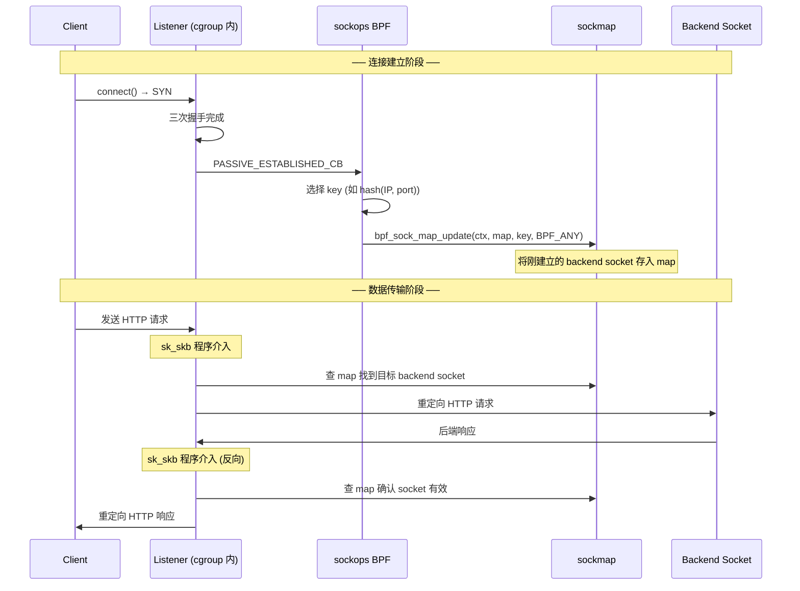
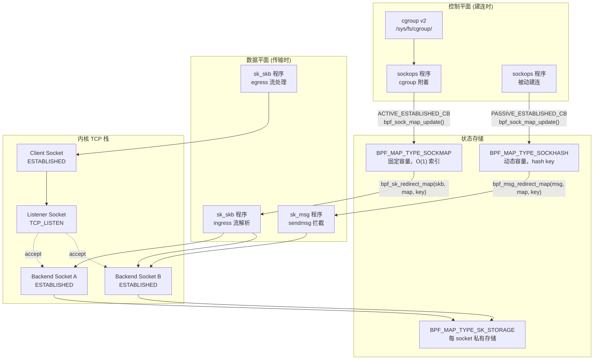

# sockops 与 sockmap 联动：内核态四层负载均衡

> **💡 本章你将理解：**
> - sockops 如何在建连时自动将 socket 插入 sockmap，供后续 BPF 程序做流量重定向
> - 为什么 sockmap 插入只能发生在三个特定操作码中
> - 完整的 sockops→sockmap→sk_skb/sk_msg 三层 BPF 协作模型
> - 真实生产场景（四层负载均衡 + 连接池管理）

---

## 一、sockmap 概念速览

**直觉描述：** sockmap 是一个"socket 地址簿" —— 它是一张 BPF map，存储的不是数值或结构体，而是**socket 文件描述符的引用**。一旦 socket 被存入 sockmap，其他 BPF 程序（`BPF_PROG_TYPE_SK_SKB` 或 `BPF_PROG_TYPE_SK_MSG`）就可以在数据包/消息到达时，查这张 map 找到目标 socket，然后将数据包**重定向**过去。



三者的分工：

| 组件 | 附着位置 | 职责 |
|---|---|---|
| **sockops** | cgroup | **填充** ← 建连时将 socket 写入 map |
| **sk_skb** | sockmap/sockhash | **转发** ← 包到达时查 map，重定向到目标 socket |
| **sk_msg** | sockmap/sockhash | **转发** ← sendmsg 调用时查 map，重定向消息 |

---

## 二、为什么只有三个操作码允许插入 sockmap？

**源码位置：** `net/core/sock_map.c:521-526`

```c
static bool sock_map_op_okay(const struct bpf_sock_ops_kern *ops)
{
    return ops->op == BPF_SOCK_OPS_PASSIVE_ESTABLISHED_CB ||
           ops->op == BPF_SOCK_OPS_ACTIVE_ESTABLISHED_CB ||
           ops->op == BPF_SOCK_OPS_TCP_LISTEN_CB;
}
```

这个"白名单"是内核有意为之的严格限制。`bpf_sock_map_update()` 在执行任何插入操作前，第一步就是调用 `sock_map_op_okay()` 验证当前操作码（`net/core/sock_map.c:627-628`）。

### 2.1 三个允许操作码的选择逻辑

```
问题：在 TCP 生命周期的哪个点将 socket 插入 sockmap？
                              ┌────────────────────┐
                              │  插入时机选择        │
                              └────────┬───────────┘
        ┌─────────────────────────────┼────────────────────────────┐
        ▼                             ▼                             ▼
┌──────────────┐          ┌──────────────────────┐      ┌──────────────────┐
│ listen() 时   │          │ 三次握手完成后          │      │ RTO/STATE_CB     │
│ TCP_LISTEN_CB │          │ ACTIVE/PASSIVE         │      │ 运行时           │
│              │          │ ESTABLISHED_CB          │      │                  │
└──────┬───────┘          └──────────┬─────────────┘      └──────┬───────────┘
       │                             │                            │
   ✓ 允许                     ✓ 允许                         ✗ 拒绝

动机:
· Listener socket 在 map 中              · 完整的 socket 已就绪           · 运行时 socket 可能在
  作为"反向代理入口"——所有                · 所有 TCP 参数已初始化          任意状态 (FIN_WAIT, 
  新连接先到达 listener,                   · sk_skb/sk_msg 重定向到       TIME_WAIT) — 不安全
  sk_skb 再将其重定向到                    此 socket 是安全的              · 反复插入同一 socket
  map 中的后端 socket                                                     —— 并发竞争
                                                                          · 通知回调路径不持
                                                                          有 socket 锁
```

### 2.2 拒绝其他操作码的根本原因

| 操作码 | 拒绝原因 |
|---|---|
| `TCP_CONNECT_CB` | socket 尚在 SYN_SENT 状态，未完成三次握手；接受方不可用 |
| `RTO_CB` / `RETRANS_CB` / `RTT_CB` | 运行时事件，socket 可能已在 map 中；重复插入会损坏 map 状态 |
| `STATE_CB` | 可能在 FIN_WAIT/CLOSE 等状态触发；sockmap 不应持有即将关闭的 socket |
| `TIMEOUT_INIT` / `RWND_INIT` ... | 同步操作——调用路径不持有 socket 锁的完整上下文 |
| `HDR_OPT_*` / `TSTAMP_*` | 与连接管理无关；插入操作在此处无业务意义 |

💡 **设计动机 —— 为什么不允许在 `TCP_CONNECT_CB` 中插入？**
看似合理——client 端在其连接建立前就将 socket 加入 map，等连接建立后 server 端流量自动重定向过来。但问题在于：`TCP_CONNECT_CB` 发生在 SYN 发送前，如果 SYN 丢失需要重传，socket 可能长时间无法进入 ESTABLISHED 状态。此时 sk_skb 程序若尝试将流量重定向到一个未建立的 socket，TCP 栈会直接丢弃——等价于丢包。为了避免这种"半连接期转发"，内核要求 sockmap 仅接受已建立或可监听的 socket。

---

## 三、sockops → sockmap 插入流程全解剖

### 3.1 入口：`bpf_sock_map_update()` BPF 辅助函数

**源码位置：** `net/core/sock_map.c:622-632`

```c
BPF_CALL_4(bpf_sock_map_update, struct bpf_sock_ops_kern *, sops,
           struct bpf_map *, map, void *, key, u64, flags)
{
    WARN_ON_ONCE(!rcu_read_lock_held());

    // ⑴ 两步门禁检查
    if (likely(sock_map_sk_is_suitable(sops->sk) &&  // 是否 TCP/UDP socket
               sock_map_op_okay(sops)))               // 操作码白名单
        // ⑵ 通过门禁 → 执行实际插入
        return sock_map_update_common(map, *(u32 *)key, sops->sk, flags);

    return -EOPNOTSUPP;  // 门禁不通过 → 静默拒绝
}
```

门禁有两层：
1. **`sock_map_sk_is_suitable(sk)`** — 检查 socket 是否支持 psock 协议升级（`net/core/sock_map.c:536-539`）：必须实现了 `sk_prot->psock_update_sk_prot`。只有 TCP/UDP socket 满足此条件。
2. **`sock_map_op_okay(sops)`** — 操作码白名单。两个检查串在一起，任何一个失败都返回 `-EOPNOTSUPP`。

### 3.2 深层：`sock_map_update_common()` — 带锁的 map 插入

**源码位置：** `net/core/sock_map.c:470-519`

```c
static int sock_map_update_common(struct bpf_map *map, u32 idx,
                                  struct sock *sk, u64 flags)
{
    struct bpf_stab *stab = container_of(map, struct bpf_stab, map);
    struct sk_psock_link *link;
    struct sk_psock *psock;
    struct sock *osk;
    int ret;

    WARN_ON_ONCE(!rcu_read_lock_held());
    if (unlikely(flags > BPF_EXIST))
        return -EINVAL;
    if (unlikely(idx >= map->max_entries))
        return -E2BIG;

    // ⑴ 分配 psock 链接节点
    link = sk_psock_init_link();
    if (!link)
        return -ENOMEM;

    // ⑵ 关键：将 socket 升级为 psock
    //     sock_map_link() 内部会调用 sk_psock_init()
    //     将 sk->sk_prot 替换为支持 BPF hook 的协议结构体
    ret = sock_map_link(map, sk);
    if (ret < 0)
        goto out_free;

    psock = sk_psock(sk);
    WARN_ON_ONCE(!psock);

    // ⑶ 持有 map 锁后执行插入
    spin_lock_bh(&stab->lock);
    osk = stab->sks[idx];
    if (osk && flags == BPF_NOEXIST) {   // 冲突：位置已占用 + NOEXIST
        ret = -EEXIST;
        goto out_unlock;
    } else if (!osk && flags == BPF_EXIST) { // 空位 + 要求 EXIST
        ret = -ENOENT;
        goto out_unlock;
    }

    // ⑷ 双向链接：psock ←→ map
    //     sock_map_add_link() 将 link 添加到 psock 的链路列表
    //     psock->link 是一个链表，记录了该 socket 被哪些 map 引用
    sock_map_add_link(psock, link, map, &stab->sks[idx]);
    stab->sks[idx] = sk;              // 更新 map 数组

    // ⑸ 若替换了旧 socket → 释放旧引用
    if (osk)
        sock_map_unref(osk, &stab->sks[idx]);
    spin_unlock_bh(&stab->lock);
    return 0;

out_unlock:
    spin_unlock_bh(&stab->lock);
    if (psock)
        sk_psock_put(sk, psock);
out_free:
    sk_psock_free_link(link);
    return ret;
}
```

⚠️ **易错点 —— psock 协议升级的副作用：**
`sock_map_link()` 会将 socket 的 `sk_prot` 替换为支持 BPF hook 的版本。这意味着：
- socket 在**插入 sockmap 的那一刻**就失去了其"纯净" TCP 协议栈行为
- 即使 socket 后来从 map 中被删除，`sk_prot` 的替换**不可逆**
- 这个协议替换引入了一次额外的内存分配（`sk_psock` 结构体）

🔒 **并发安全警示 —— spin_lock_bh 的边界：**
sockmap 的插入操作使用 `spin_lock_bh(&stab->lock)` 而非 RCU 锁。这意味着在持有锁期间**禁用了 bottom half**（中断下半部），防止插入操作与 sockmap 的 sk_skb 程序同时修改 `stab->sks[idx]`。但这也意味着：**sockmap 插入不能在原子上下文（中断 / NAPI 软中断）中执行**，只能在进程上下文或持有 socket 锁的 sockops 回调中执行。

---

## 四、sockhash 的等价路径

`sockhash`（`BPF_MAP_TYPE_SOCKHASH`）使用哈希表而非数组索引，插入函数为 `bpf_sock_hash_update()`。其门禁检查与 sockmap 完全相同，区别在于：

| 特性 | sockmap | sockhash |
|---|---|---|
| 存储结构 | 定长数组 `sks[max_entries]` | 哈希表 |
| key 类型 | `u32` 索引 | 任意类型（按 hash 分布） |
| 查找开销 | O(1) 直接索引 | O(1) 均摊（哈希查找） |
| 容量 | 编译期固定 | 动态增长 |
| 适用场景 | 少量固定后端（如 3 副本服务） | 大规模动态后端池 |

---

## 五、完整三层协作示例：TCP 反向代理

以下是一个最小化的内核态四层负载均衡实现：



### 5.1 sockops 程序：建立连接时写入 sockmap

```c
#include <linux/bpf.h>
#include <bpf/bpf_helpers.h>

struct {
    __uint(type, BPF_MAP_TYPE_SOCKMAP);
    __uint(max_entries, 65536);
    __type(key, __u32);
    __type(value, __u64);
} sock_map SEC(".maps");

SEC("sockops")
int sockmap_handler(struct bpf_sock_ops *skops)
{
    __u32 key = 0;

    switch (skops->op) {
    case BPF_SOCK_OPS_PASSIVE_ESTABLISHED_CB:
        /* 使用远端端口作为 key */
        key = skops->remote_port;

        /* 将被动建连的 socket 插入 sockmap */
        bpf_sock_map_update(skops, &sock_map, &key, BPF_NOEXIST);
        break;

    case BPF_SOCK_OPS_ACTIVE_ESTABLISHED_CB:
        /* 主动端也可以插入 (例如作为出站代理) */
        key = skops->local_port;
        bpf_sock_map_update(skops, &sock_map, &key, BPF_NOEXIST);
        break;

    default:
        break;
    }
    return 0;
}

char LICENSE[] SEC("license") = "GPL";
```

### 5.2 sk_skb 程序：在数据包到达时重定向

```c
SEC("sk_skb")
int redirect_to_backend(struct __sk_buff *skb)
{
    __u32 key = skb->remote_port;  // 或其他键值

    /* 查 sockmap 找到目标 socket，重定向 */
    return bpf_sk_redirect_map(skb, &sock_map, key, 0);
}

SEC("sk_skb")
int redirect_to_client(struct __sk_buff *skb)
{
    __u32 key = skb->local_port;

    /* 反向路径：将后端响应送回客户端 */
    return bpf_sk_redirect_map(skb, &sock_map, key, BPF_F_INGRESS);
}
```

### 5.3 加载命令序列

```bash
# 加载 sockops 程序
$ bpftool prog load sockops_prog.o /sys/fs/bpf/sockops_prog type sockops
$ bpftool cgroup attach /sys/fs/cgroup/unified/ sock_ops \
         pinned /sys/fs/bpf/sockops_prog

# 加载 sk_skb 流解析程序 (ingress)
$ bpftool prog load skb_ingress.o /sys/fs/bpf/redirect_ingress type sk_skb \
         map name sock_map pinned /sys/fs/bpf/sock_map
$ bpftool prog attach pinned /sys/fs/bpf/redirect_ingress sk_skb_stream_verdict \
         pinned /sys/fs/bpf/sock_map

# 加载 sk_skb 流解析程序 (egress)
$ bpftool prog load skb_egress.o /sys/fs/bpf/redirect_egress type sk_skb \
         map name sock_map pinned /sys/fs/bpf/sock_map
$ bpftool prog attach pinned /sys/fs/bpf/redirect_egress sk_skb_stream_parser \
         pinned /sys/fs/bpf/sock_map
```

---

## 六、socket 从 sockmap 中移除的生命周期

socket 从 sockmap 中移除有三种路径：

```
┌─────────────────────────────────────────────────────────────────┐
│                     socket 退出 sockmap                          │
│                                                                 │
│  ① 显式删除:                                                     │
│     bpf_map_delete_elem(&sock_map, &key)                        │
│     → sock_map_delete_elem()                                    │
│     → __sock_map_delete()                                       │
│     → 释放 link, 递减引用计数                                    │
│                                                                 │
│  ② BPF 程序替换:                                                 │
│     bpf_sock_map_update(key, new_sk, BPF_ANY)                   │
│     → sock_map_update_common()                                  │
│     → sock_map_unref(old_sk)                                    │
│                                                                 │
│  ③ socket 关闭:                                                  │
│     tcp_close() → sk_prot->close()                              │
│     → sk_psock_drop() → 遍历 psock->link 链表                   │
│     → 从所有关联的 sockmap/sockhash 中移除该 socket              │
│     → 释放 sk_psock 结构体                                       │
│                                                                 │
│  ⚠️ 注意: socket 关闭时，自动从 map 中移除                       │
│     不需要 BPF 程序显式清理                                       │
└─────────────────────────────────────────────────────────────────┘
```

💡 **设计动机 —— 自动清理机制：**
`sock_map_unref()` 在 socket 关闭时自动触发——内核通过在 `sk_prot->close` 中注入 `sk_psock_drop()` 实现（`net/core/sock_map.c` 中的 `tcp_bpf_prots` 替换协议）。这保证了 sockmap 不会持有已关闭 socket 的"悬挂引用"——如果 sk_skb 程序试图重定向到一个已关闭的 socket，`sock_map_redirect_allowed()` 中的状态检查会拒绝并返回 `SK_DROP`。

---

## 七、完整架构全景图



---

> **📝 一句话回顾：** sockops 与 sockmap 的联动 = 控制平面（建连时插入 map）与数据平面（传输时查 map 重定向）的分离式架构——sockops 只负责"注册"（写入），sk_skb/sk_msg 只负责"分发"（查找），两者通过 sockmap 这一共享存储空间完成解耦；插入限制的三个操作码（PASSIVE/ACTIVE_ESTABLISHED + LISTEN）确保了 map 中只存储有效、可转发的 socket。

接下来请阅读 [`debugging-and-tuning.md`](./debugging-and-tuning.md)，了解生产环境排障决策树与诊断工具。
