# per-cpu 变量的静态和动态分配

## 参考

- 🌟[Linux 内核同步机制之（二）：Per-CPU 变量](http://www.wowotech.net/kernel_synchronization/per-cpu.html)
- 🌟[Linux per-cpu_linux percpu-CSDN 博客](https://blog.csdn.net/weixin_45030965/article/details/126289230)
- [每个 CPU 的变量 | linux-insides-zh](https://docs.hust.openatom.club/linux-insides-zh/concepts/linux-cpu-1)

## 概览

使用当前 cpu 变量时，应 `preempt_disable();` 禁止抢占，放置在 task 上下文时发生抢占，导致当前 task 在使用 cpu 变量时，被抢占后，被切换到其他 cpu 上运行。

静态 per-cpu 变量原理：

1. `__per_cpu_offset[NR_CPUS]` 数组，保存了偏移量（x86 架构会使用 `this_cpu_off` 这个 per-cpu 的变量，含义和前者一样，但更为高效）。
2. 对于 per-cpu 变量，这里将原始 per-cpu 变量称为 var，将属于 cpu N 的副本变量称为 varN。
3. 静态 per-cpu 原始变量 var 存放在 `.data..percpu` section 里（实际上这个 section 会被回收）。
4. varN 的地址是 `&var + __per_cpu_offset[N]`。

### 定义静态 per-cpu 变量

```cpp
#define PER_CPU_BASE_SECTION ".data..percpu"

#define __PCPU_ATTRS(sec)						\
	__percpu __attribute__((section(PER_CPU_BASE_SECTION sec)))	\
	PER_CPU_ATTRIBUTES

#define DEFINE_PER_CPU_SECTION(type, name, sec)				\
	__PCPU_ATTRS(sec) __typeof__(type) name

#define DEFINE_PER_CPU(type, name)					\
	DEFINE_PER_CPU_SECTION(type, name, "")
```

将变量放在 `.data..percpu` section 里。

### 动态分配 per-cpu 变量

```cpp
#define alloc_percpu(type)						\
	(typeof(type) __percpu *)__alloc_percpu(sizeof(type),		\
						__alignof__(type))

extern void free_percpu(void __percpu *__pdata);
```

### 访问 per-cpu 变量

形如 `*_ptr()` 的 API 表明传入的是指针。

```cpp
#define per_cpu_offset(x) (__per_cpu_offset[x])

#define per_cpu_ptr(ptr, cpu)						\
({									\
	__verify_pcpu_ptr(ptr);						\
	SHIFT_PERCPU_PTR((ptr), per_cpu_offset((cpu)));			\
})

/* 获取指定 cpu 上的 per-cpu 变量 */
#define per_cpu(var, cpu)	(*per_cpu_ptr(&(var), cpu))

/* arch/x86/include/asm/percpu.h */
#define arch_raw_cpu_ptr(_ptr)						\
({									\
	unsigned long tcp_ptr__ = raw_cpu_read_long(this_cpu_off);	\
									\
	tcp_ptr__ += (__force unsigned long)(_ptr);			\
	(typeof(*(_ptr)) __kernel __force *)tcp_ptr__;			\
})

#define raw_cpu_ptr(ptr)						\
({									\
	__verify_pcpu_ptr(ptr);						\
	arch_raw_cpu_ptr(ptr);						\
})
#define this_cpu_ptr(ptr) raw_cpu_ptr(ptr)

/* 传入一个 lvalue，该 lvalue 的地址 + per-cpu 的 this_cpu_off 就是我们想要取得的变量的地址 */
#define get_cpu_var(var)						\
(*({									\
	preempt_disable();						\
	this_cpu_ptr(&var);						\
}))

#define put_cpu_var(var)						\
do {									\
	(void)&(var);							\
	preempt_enable();						\
} while (0)

/* 传入一个指针，这个指针本身的值作为一个偏移量使用，加上 per-cpu 的 this_cpu_off 就是我们想要取得的变量的地址  */
#define get_cpu_ptr(var)						\
({									\
	preempt_disable();						\
	this_cpu_ptr(var);						\
})

#define put_cpu_ptr(var)						\
do {									\
	(void)(var);							\
	preempt_enable();						\
} while (0)
```

由于动态分配得到的是指针，所以只能用 `per_cpu_ptr()`, `get_cpu_ptr()` 和 `get_cpu_ptr()` 等等。

### 例子

```cpp
DEFINE_PER_CPU(unsigned long, process_counts) = 0;

int nr_processes(void)
{
	int cpu;
	int total = 0;

	for_each_possible_cpu(cpu)
		total += per_cpu(process_counts, cpu);

	return total;
}
```

代码在 [test_percpu.c](../src/mm/test_percpu.c)

## 代码分析

### 结构体

TODO

### 初始化

概述

1. 假设有 N 个 cpu，则会创建一个 chunk，其中有 N 个 unit（**对应 N 个 cpu**）。都会分配好内存，然后进行 vmap。
2. `.data..percpu` section 内的 per-cpu 变量会被 memcpy 到 N 个 unit 中（`pcpu_base_addr` 开始的区域）。
3. 由 `arch/x86/kernel/vmlinux.lds.S` 可知，`.data..percpu` section 内的变量位于 `[__init_begin, __init_end]` 范围内。因此该 section 内的变量也会被 `kernel_init()->free_initmem()` 释放。
4. percpu 机制完成初始化后。`.data..percpu` section 实际上不再起实际作用了。
   static percpu 变量“真正”的起始地址变成了 `pcpu_base_addr` 而非 `__per_cpu_start`。

根据 `pcpu_setup_first_chunk()` 里的注释，实际上，我们把第一个 chunk 拆成了 3 份：`| static | [reserved] | dynamic |`

1. `[pcpu_base_addr, pcpu_base_addr + static_size]`

   cpu0 的静态 per-cpu 变量区域。因为并不会释放这些变量，所以无需为该区域创建 chunk。

   `.data..percpu` section 在 `pcpu_embed_first_chunk()` 函数里被拷贝到了这个区域。
   

2. `[pcpu_base_addr + static_size, pcpu_base_addr + static_size + reserved_size]`

   cpu0 的 per-cpu 保留区域。为部分创建了 `pcpu_reserved_chunk`

3. 剩下的。cpu0 的动态 per-cpu 变量区域。为这部分创建了 `pcpu_first_chunk`

`struct pcpu_chunk` 只记录了 chunk 内 cpu0 这个 unit 的 per-cpu 区域范围，其他的 unit 区域范围很容易计算出。

```cpp
/* 初始化 percpu 相关。
   在此函数之前，不可以使用静态 percpu 变量？ */
start_kernel()->setup_per_cpu_areas()
  /* 初始化第一个 chunk
     可通过 percpu_alloc=page cmdline 改用 pcpu_page_first_chunk() */
  pcpu_embed_first_chunk()
    /* upa 最后就是 cpu 数量
       ai->unit_size 是 chunk 内每个 unit 的大小，我这里是 0x80000 也就是 512KB
       nr_groups 就是 NUMA node 数量
       gi->nr_units 就是 cpu 数量，gi->base_offset 是 0 */
    pcpu_build_alloc_info()
    /* 单个 unit 实际上用到的大小，这个会比 ai->unit_size 小 */
    size_sum = ai->static_size + ai->reserved_size + ai->dyn_size;
    /* 分配该 chunk 使用的内存 */
    ptr = pcpu_fc_alloc(size=gi->nr_units * ai->unit_size)
    base = min(ptr, base);
    /* 将 .data..percpu section 拷贝到该 chunk */
    for (i = 0; i < gi->nr_units; i++, ptr += ai->unit_size)
      memcpy(ptr, __per_cpu_load, ai->static_size);
      /* 每个 unit 内不会被用到的区域释放掉 */
      pcpu_fc_free(ptr + size_sum, ai->unit_size - size_sum);
    pcpu_setup_first_chunk(ai, base);
      /* pcpu_unit_offsets 是各 unit 到 pcpu_base_addr 的偏移 */
      pcpu_unit_offsets = unit_off;
      /* pcpu_reserved_chunk 用于后续的保留 per-cpu 分配 */
      tmp_addr = (unsigned long)base_addr + static_size;
      pcpu_reserved_chunk = pcpu_alloc_first_chunk(tmp_addr, ai->reserved_size);
      /* pcpu_first_chunk 用于后续的动态 per-cpu 分配 */
      tmp_addr = (unsigned long)base_addr + static_size + ai->reserved_size;
      pcpu_first_chunk = pcpu_alloc_first_chunk(tmp_addr, dyn_size);
      /* 这个地址其实就是前面 pcpu_fc_alloc 得到的那个地址，也就是 static percpu 的起始地址 */
      pcpu_base_addr = base_addr;
  delta = (unsigned long)pcpu_base_addr - (unsigned long)__per_cpu_start;
  for_each_possible_cpu(cpu)
    per_cpu_offset(cpu) = delta + pcpu_unit_offsets[cpu];
    per_cpu(this_cpu_off, cpu) = per_cpu_offset(cpu);


alloc_percpu()->pcpu_alloc_noprof()
  /* 找到一个何时 chunk，没有则创建一个 */
  ...
  /* 从 chunk 中找到可用的区域，通过 bitmap 找的 */
  pcpu_alloc_area()
  /* 对于该区域内还未分配内存的地方，进行内存分配 */
  for_each_clear_bitrange_from(rs, re, chunk->populated, page_end)
    pcpu_populate_chunk(chunk, rs, re, pcpu_gfp);
      pcpu_alloc_pages() /* 为每个 unit(也就是 cpu) 分配 0 阶的页面 */
      pcpu_map_pages() /* 为每个 unit 进行 vmap */
        __pcpu_map_pages(addr = pcpu_chunk_addr(chunk, cpu, page_start), ...)
    /* 分配好内存后，将 chunk->populated 位图置 1  */
    pcpu_chunk_populated(chunk, rs, re);

static unsigned long pcpu_unit_page_offset(unsigned int cpu, int page_idx)
{
	return pcpu_unit_offsets[cpu] + (page_idx << PAGE_SHIFT);
}
static unsigned long pcpu_chunk_addr(struct pcpu_chunk *chunk,
				     unsigned int cpu, int page_idx)
{
	return (unsigned long)chunk->base_addr +
	       pcpu_unit_page_offset(cpu, page_idx);
}
```

`pcpu_base_addr` 是 static percpu 变量“真正”的起始地址。

`pcpu_unit_offsets[cpu]` 是 unit N 相对于 `pcpu_base_addr`的偏移。显然，`pcpu_unit_offsets[0]` 值为 0。

后续，当 `alloc_percpu()` 时找不到空闲的 chunk 时（`pcpu_first_chunk` 已满），就会创建新的 `struct pcpu_chunk`。
对于从 `alloc_percpu()` 从新的 chunk 得到的 dynamic percpu 变量，`pcpu_unit_offsets[cpu]` 是变量所在的 unit 相对于 `chunk->base_addr` 的偏移。

现在可以弄明白 `per_cpu_ptr()` 宏了：

```cpp
per_cpu_ptr(ptr, cpu)
= ptr + __per_cpu_offset[cpu]
= ptr + delta + pcpu_unit_offsets[cpu]
= ptr + pcpu_base_addr - __per_cpu_start + pcpu_unit_offsets[cpu]
= pcpu_base_addr + pcpu_unit_offsets[cpu] + ptr - __per_cpu_start
```

对于 static percpu 变量，可推导得：

```cpp
= 变量所在的unit的基址 + ptr - __per_cpu_start
= 变量所在的unit的基址 + 变量在unit内的偏移
```

对于 dynamic percpu 变量，由 `pcpu_alloc_noprof()` 可知返回的 ptr 是 `__addr_to_pcpu_ptr(chunk->base_addr + off)`，可推导得：

```cpp
= pcpu_base_addr + pcpu_unit_offsets[cpu] + __addr_to_pcpu_ptr(chunk->base_addr + 变量在unit内的偏移) - __per_cpu_start
= pcpu_base_addr + pcpu_unit_offsets[cpu] + chunk->base_addr + 变量在unit内的偏移 - pcpu_base_addr + __per_cpu_start - __per_cpu_start
= pcpu_unit_offsets[cpu] + chunk->base_addr + 变量在unit内的偏移
= 变量所在的unit的基址 + 变量在unit内的偏移
```

## 历史

### [\[PATCHSET x86/core/percpu\] implement dynamic percpu allocator - Tejun Heo](https://lore.kernel.org/lkml/1234958676-27618-1-git-send-email-tj@kernel.org/)

### [\[PATCHSET percpu#for-next\] implement and use sparse embedding first chunk allocator - Tejun Heo](https://lore.kernel.org/all/1248171979-29166-1-git-send-email-tj@kernel.org/)
