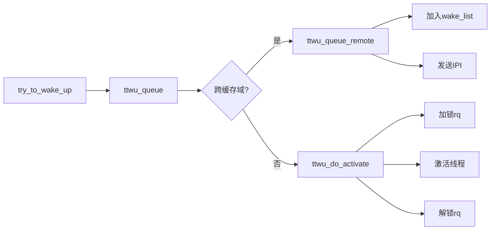

### ttwu_queue：Linux 内核线程唤醒的关键路径

**ttwu_queue 是 Linux 内核中负责将待唤醒线程加入目标 CPU 运行队列的核心函数**，是 try_to_wake_up()流程的关键环节。其主要作用是根据 CPU 缓存共享情况，决定采用本地加锁还是远程 IPI（处理器间中断）的方式处理线程唤醒，以优化性能。

#### 核心功能与实现逻辑

ttwu_queue 的核心逻辑可概括为：

```cpp
static void ttwu_queue(struct task_struct *p, int cpu)
{
    struct rq *rq = cpu_rq(cpu);
#if defined(CONFIG_SMP)
    if (sched_feat(TTWU_QUEUE) && !cpus_share_cache(smp_processor_id(), cpu)) {
        sched_clock_cpu(cpu); /* 同步跨CPU时钟 */
        ttwu_queue_remote(p, cpu);
        return;
    }
#endif
    raw_spin_lock(&rq->lock);
    ttwu_do_activate(rq, p, 0);
    raw_spin_unlock(&rq->lock);
}
```

**关键判断条件**：

1. **TTWU_QUEUE 特性开关**：默认开启，控制是否启用远程唤醒优化
2. **缓存共享检测**：通过 cpus_share_cache()判断当前 CPU 与目标 CPU 是否共享 LLC（末级缓存）

#### 两种唤醒路径

**1. 远程唤醒路径（跨缓存域）**

- 当目标 CPU 与当前 CPU 不共享 LLC 时，调用 ttwu_queue_remote()
- 将线程加入目标 CPU 的 wake_list 队列
- 发送 IPI 中断触发目标 CPU 处理唤醒（通过 smp_send_reschedule()）
- **核心优势**：避免跨 CPU 加锁竞争，将唤醒成本转移到目标 CPU

**2. 本地唤醒路径（同缓存域）**

- 直接对目标 CPU 的运行队列（rq）加锁
- 调用 ttwu_do_activate()完成线程激活
- 将线程状态设为 TASK_RUNNING 并加入就绪队列
- **性能考量**：同缓存域下加锁开销小于 IPI 中断

#### 性能优化背景

早期内核实现中，只要唤醒非本 CPU 线程就发送 IPI，导致**IPI 中断负载过高**。实测显示在 netperf TCP_RR 测试中，IPI 开销占总开销的 13%。TTWU_QUEUE 特性通过以下方式优化：

- 仅在跨缓存域唤醒时使用 IPI
- 同缓存域唤醒保持传统加锁方式
- 将唤醒处理延迟到目标 CPU 的下一次调度点

#### 关键数据结构交互



#### 实际应用与性能影响

在 KVM 虚拟化环境中，TTWU_QUEUE 是重要的性能调优选项。当虚拟机跨 NUMA 节点调度时，合理配置 TTWU_QUEUE 可显著减少：

- 跨 CPU 锁竞争
- IPI 中断风暴
- 缓存一致性流量

**典型配置建议**：

```bash
# 查看当前设置
cat /sys/kernel/debug/sched_features | grep TTWU_QUEUE
# 启用TTWU_QUEUE（默认开启）
echo TTWU_QUEUE > /sys/kernel/debug/sched_features
```

**注意事项**：

- TTWU_QUEUE 依赖 CONFIG_SMP 配置
- 对实时性要求高的场景可能需要关闭该特性
- 在高负载 NUMA 系统中收益最明显

通过这种精细化的唤醒机制，Linux 内核在多处理器系统中实现了性能与复杂度的平衡，是理解内核调度子系统的重要入口点。
